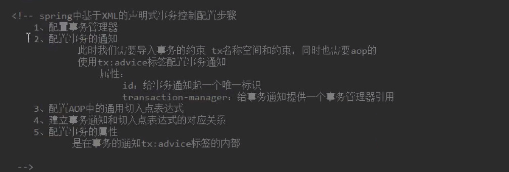
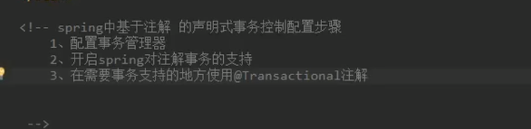

# Spring

## 优势


**耦合**：程序间的依赖关系

- 类之间的依赖关系

- 方法之间的依赖

**解耦**：降低程序间的依赖关系

实际开发中，应做到编译时不依赖，运行时才依赖。

**解耦思路**:

​		第一步：使用反射来创建对象，而避免使用new关键字

​		第二步：通过读取配置文件来获取创建对象的全限定类名。

**两种核心容器：**

- BeanFactory：Bean工厂
- ApplicationContext：应用上下文


## IOC （inversion of control）

思想：反转资源获取的方向
在***容器***主动的将资源**推送**给他所管理的***组件***，组件所要做的仅是选择一种**合适的方式来接收资源**，==**降低程序间的依赖关系，并不能解耦**==

### IOC分析：

**new 的方式** ：（主动寻找资源，明显的依赖关系，且无法消除,完全自主，独立的控制权）

```java
private AccountEao dao = new AccountEaoImpl();
```


**工厂模式**：(可降低程序间依赖关系，但无法得知获取的资源是否可用)

```java
private AccountEao dao = (AccountEao)BeanFactory.getBean("accountEao");
```


### spring实现

1. 创建xml文件

   ```java
   <?xml version="1.0" encoding="UTF-8"?>
   <beans xmlns="http://www.springframework.org/schema/beans"
       xmlns:xsi="http://www.w3.org/2001/XMLSchema-instance" xmlns:context="http://www.springframework.org/schema/context"
   	xsi:schemaLocation="http://www.springframework.org/schema/beans http://www.springframework.org/schema/beans/spring-beans.xsd
       http://www.springframework.org/schema/context http://www.springframework.org/schema/context/spring-context-4.0.xsd">
   	
       <bean id="accountEao" class="club.twzw.dao.impl.accountEaoImpl">
       </bean>
   </beans>
   ```

2. 在视图层（假装是）调用

   ```java
   public class Client{
       public static void main(String[] args){
           //1. 获取核心容器对象
           ApplicationContext ac = new ClassPathXmlApplicationContext("bean.xml");
           //2. 根据id获取bean对象
           AccountEao dao = ac.getBean("accountEao",AccountEao.class);
           //或
           AccountEao dao = (AccountEao)ac.getBean("accountEao");
           System.out.println(dao);
       }
   }
   ```

### ApplicationContext的三个常用实现类：

- ClassPathXmlApplicationContext : 它可以加载==类路径==下的配置文件，要求配置文件必须在类路径下。
- FileSystemXmlApplicationContext ： 它可以加载==磁盘任意路径下==的配置文件。（必须要有==访问权限==）
- AnnotationConfigApplicationContext ： 它用于读取注解创建容器的。

### 核心容器引发的问题

  - **ApplicationContext**：（单例对象适用）---实际开发更多采用ApplicationContext

    它在构建核心容器时，==创建对象==采取的策略是==立即加载==的方式。只要一读读取完就创建配置文件中配置的对象

  -  **BeanFactory**：（多例对象适用）

    它在构建核心容器时，创建对象采取的策略是**延迟加载**的方式。也就是说，什么时候根据id获取对象了，什么时候才真正的创建对象。

## DI（dependency injection）

**组件以先定义好的方式（例如：setter）来接受来自容器的资源注入**

==依赖关系==:在当前类需要调用其他类的对象，由spring为我们提供，我们只需要在配置文件中说明依赖关系的维护。

依赖关系的管理：以后都交给spring来维护

### 依赖注入数据类型

- 基本类型和string
- 其他bean类型（在配置文件中或者注解配置过的bean）
- 复杂类型/集合类型

### 注入方式（bean的装配）

- 使用构造函数提供
- 使用set方法提供
- 使用注解提供

**一个bean组件**

```java
public class AccountServiceImpl implements accountService{
    private String name;
    private Integer age;
    private Eate date;
    
    public AccountServiceImpl (String name,Integer age,Eate date){
        this.name = name;
        this.age = age;
        this.date = date;
    }
}
```

#### **构造器注入**

使用标签==constructor-arg==，位置:==bean标签==的==内部==

标签属性：

 - type:用于指定要注入的数据的数据类型
 - index：用于指定要注入的数据给构造函数中指定==索引位置==的参数==赋值==。索引位置从0开始
 - name:用于指定给构造函数中指定==名称==参数赋值
 - value:用于提供基本类型和String类型的数据
 - ref:用于指定其他的bean类型数据，它指的就是Spring的Ioc核心容器出现过的bean对象

```xml
<bean id="accountService" class="club.twzw.service.Impl.AccountServiceImpl">
	<constructor-arg name="name" value="comi"></constructor-arg>
    <constructor-arg name="age" value="18"></constructor-arg>
    <constructor-arg name="name" ref="currentTime"></constructor-arg>
</bean>

<!--处理特殊类型如Eate，可以使用ref的方式-->
<bean id="currentTime" class="java.util.Eate"></bean>
```

**优势：**

​		在获取bean对象是注入的数据是必须的操作，否则对象无法创建成功。

**弊端：**

​		改变了bena对象的实例化的方式，是我们在创建对象时，如果不使用这些数据，也必须提供数据。

#### set方法注入（更常用）

使用标签==property==，位置:==bean标签==的==内部==

标签属性：

	- name：找指定注入时所调用的set方法名称
	- value:用于提供基本类型和String类型的数据
 - ref:用于指定其他的bean类型数据，它指的就是Spring的Ioc核心容器出现过的bean对象

```xml
<bean id="accountService" class="club.twzw.service.Impl.AccountServiceImpl">
	<property name="name" value="comi"></property>
    <property name="age" value="18"></property>
    <property name="date" value="currentTime"></property>
</bean>

<!--处理特殊类型如Eate，可以使用ref的方式-->
<bean id="currentTime" class="java.util.Eate"></bean>
```

**优势：**

​		创建对象时没有明确的限制

**弊端：**

​		如果有一个成员必须有值，set方法无法保证一定注入，即未使用property标签

#### 复杂类型注入

```java
public class AccountServiceImpl implements accountService{
    private Map<String,String> myMap;
    private List<String> myList;
    private Set<String> mySet;
    private Properties myProps;
    private String[] mystrs;
    
    //省略set方法
}
```

**集合类型注入**

用于给List结构集合注入的标签：

- list
- array
- set

用于给map结构集合注入的标签：

- map
- props

**结构相同，标签可以互换**

```xml
<bean id="accountService" class="club.twzw.service.Impl.AccountServiceImpl">
	<property name="mystrs">
    	<array>
        	<value>a</value>
            <value>b</value>
            <value>c</value>
        </array>
    </property>
    <property name="myMap">
    	<map>
        	<entry key="testA" value="11"></entry>
            <entry key="testB">
            	<value>bb</value>
            </entry>
        </map>
    </property>
    <property name="mySet">
    	<set>
        	<value>a</value>
            <value>b</value>
            <value>c</value>
        </set>
    </property>
    <property name="myList">
    	<list>
        	<value>a</value>
            <value>b</value>
            <value>c</value>
        </list>
    </property>
    <property name="myList">
    	<props>
        	<prop key="testA">a</prop>
            <prop key="testB">b</prop>
            <prop key="testC">c</prop>
        </props>
    </property>
</bean>
```

## spring基于注解的Ioc及Ioc案例

### Ioc常用注解

使用前需要配置xml的==包扫描==功能

```xml
<!-- 需要添加xmlns：context等约束-->
<context:component-scan base-package="club.twzw"></context:component-scan>
```

- 用于==创建对象==的注解 <bean>作用相同

  - @Component：用于把当前对象存入spring容器中

    - @Component（==value===“account”）：指定了Component的==id==，如果不指定默认为该类的首字母小写
  - @Controller:表现层
  - @Service:业务层
  - @Repository:持久层
  
- 用于注入数据  <bean>标签内部的<property>
  - @Autowired：只要容器中有唯一的一个bean对象类型和要注入的变量类型匹配，就可以注入成功
  
  - @Qualifier：按照类中注入的基础之上再按照名称注入。他给==类成员==注入时不能单独使用（需要和@Autowired一起使用），但是再给方法参数注入时，可以单独使用。
  
    	- ```java
	  	//假设有两个accountEao的实现类account1，account2
      @Autowired
      @Qualifier("account1")
      private accountEao dao;
    
		    ```
  	    ```
  	
  	- @Qualifier("account1”):用于指定注入bean的id。
  	
  - @Resource(name="account1”):==@Autowired和@Qualifier的组合版==
  
  - @Value:注入==基本类型==和==String类型==的值。支持SPEL语法：${表达式}
  
  - ==复杂数据类型==无法通过注解实现注入，只能使用==xml==实现。
  
- 用于改变作用范围 <bean>标签内部的scope

  - @scope:用于指定bean的作用范围

    - @scope（”singleton“）

      - 常用范围：singleton、prototype   

    - ```java
      @Scope("prototype")
      public class AccountServiceImpl implements AccountService{
          
      }
      ```

- 和生命周期相关  <bean>标签内部的init-method和destory-method相同(了解即可)

  - @PreEestory：设置销毁方法
  - @PostConstruct：设置初始化方法

## 配置applicationContext.xml的注解版

注解： 

 - @Configuration：指定当前类是一个配置类

 - @ConponentScan：通过注解指定spring在创建容器时要扫描的包

   	- @ConponentScan("club.twzw”)

- @Bean：用于把当前方法的返回值作为Bean对象存入spring容器中。

  - @Bean(name="runner”)：指定bean的id，不写默认为是当前方法的名称。
  - 当我们使用注解配置方法时，如果方法有参数，Spring框架会从容器中查找有没有可用的bean对象。

- 由@Bean配置的文件时**默认是单例的**，我们需要添加@scope注解修改bean的作用范围。

- @Import：导入其他配置类，其他配置类上便无需配置@Configuration，并且可表示配置文件的大小关系

  - ```java
    @Configuration
    @ComponentScan("club.twzw")	//配置包扫描
    @Import(JdbcConfig.class)	//引入其他配置文件类
    public class SpringConfigration{
        
    }
    ```

- @PropertySource:用于指定properties文件的位置

  - value：指定文件的名称和路径
    - eg：@PropertySource("classpath:jdbcConfig.properties”)
      - classpath:表示类路径下

## bean的配置

**==bean==**:在计算机英语中，有**可重用组件**的含义。**==javaBean==**：用**Java**语言编写的**可重用组件**，**不等于**实体类（即：person类、pet类等），且**远大于**实体类。

### 创建bean的三种方式

1. 使用==构造器实例化==创建，在spring的==配置文件==中使用bean标签，配置id和class属性之后，且没有其他属性和标签时，采用的是默认构造函数创建bean对象，此时如果类中没有==默认的构造函数==，则对象无法创建。

   ```xml
   <bean id="accountService" class="club.twzw.service.Impl.AccountServiceImpl"></bean>
   ```

   该句主要是去寻找==默认构造函数==

   ```java
   public class AccountServiceImpl implements accountService{
       public AccountServiceImpl (){
       }
   }
   ```

2. 使用==实例工厂方法==中的方法创建对象 （使用某个中的方法创建对象并存入spring容器）

   模拟一个工厂类InstanceFactory（该类可能是存在于jar包中，我们无法通过修改源码的方式来提供默认构造函数）

   ```java
   public class InstanceFactory{
       public AccountService getAccountService(){
           return new AccountServiceImpl();
       }
   ```

   ```xml
   <bean id="InstanceFactory" class="club.twzw.factory.InstanceFactory"></bean>
   <bean id="AccountService" factory-bean="InstanceFactory" factory-method="getAccountService"></bean>
   ```

3. 使用==静态工厂方式==中的==静态方法==创建对象

   ```java
   public class InstanceFactory{
       public static AccountService getAccountService(){
           return new AccountServiceImpl();
       }
   ```

   ```xml
   <bean id="accountService" class="club.twzw.factory.InstanceFactory" factory-method="getAccountService"></bean>
   ```

### bean标签的作用范围

bean标签的scope属性：

- 作用：指定bean标签的作用范围。

- 取值：
  - singleton	单例（默认值）
  - prototype   多例
  - request        作用于web应用的请求范围
  - session         作用与web应用的绘画范围
  - global-session   作用于集群环节的会话范围（负载均衡）
  - application：为每个ServeltContext创建实例，仅在WebApplicationContext中生效
  - webSocket：为每个WebSocket创建一个实例，仅在WebApplicationContext中生效

### bean的生命周期

- **单例**
  - 出生：当容器创建时，对象创建
  - 活着：只要容器还在，对象一直都在
  - 销毁：容器销毁，对象消亡。
  - 总结：单例对象的生命周期和容器相同
- **多例**
  - 出生： 当我们使用对象时spring框架为我们创建
  - 活着：在使用过程中
  - 销毁：当对象长时间不用且没有别的对象引用时，由java垃圾回收器回收


### bean的装配方式

- 基于xml的装配
  - 设值注入：
    - 前提：
    - Bean类必须提供一个无参构造方法
    - Bean类必须为需要注入的属性提供对应的setter方法
- 构造注入:<constructor-arg>
- 基于Annatation注解的装配

### 自动装配的方式

#### 1. **ByName**属性名自动装配

```
 	 <!--byName 根据属性名自动装配 -->
     <bean id="man" class="com.oak.entity.Man" autowire="byName">		</bean>
```

#### 2. **byType**类型自动装配

```
   	 <!--byType 根据类型名自动装配 -->
     <bean id="man" class="com.oak.entity.Man" autowire="byType"></bean>
```

#### 3. constructor自动装配

实体类中需要带有bean参数类型的构造方法

```
	<!-- constructor 装配 -->  
	<bean id="man" class="com.oak.entity.Man" autowire="constructor">
```

#### 4. autodetect自动装配

Spring首先尝试通过 constructor 使用自动装配来连接，如果它不执行，Spring 尝试通过 byType 来自动装配

```
	<!-- constructor 装配 -->  
	<bean id="man" class="com.oak.entity.Man" autowire="autodetect">
```

### 模拟bean工厂

**==bean工厂的对象==**：用于创建service和dao对象的。

如何通过bean工程创建对象（解耦思路相同）？

1. 需要一个配置文件来配置我们的service和dao。（配置的内容，唯一标识->全限定类名，通过key：value的方式可以实现）

   ```properties
   # properties 文件
   accountEao = club.twzw.myblog.dao
   accountService = club.twzw.myblog.service
   ```

2. 通过读取配置文件的内容，反射创建对象。

   具体细节实现：

   ```java
   public class BeanFactory{
       
       //定义一个Properties ;
       private static Properties props;
       //定义一个Map,用于存放我们要创建的对象，我们把它称为容器。
       private statis Map<String,Objects> beans;
       
       //使用静态代码块为Properties对象赋值
       //初始化，且该工厂模式为单例模式
       static{
           try{
               //实例化对象
               props = new Properties();
               //获取properties文件的流对象
               InputStream in = BeanFactory.class.getClassLoader().getResourceAsStream("bean.properties");
               props.load(in);
               //实例化容器
               beans = new HashMap<String,Objects>();
               //取出配置文件中所有key
               Enumeration keys = props.keys();
               //遍历枚举
               while(keys.hasMoreElements()){
                   String key = keys.nextElement().toString();
               // 根据key获取value
               String beanPath = props.getProperty(key);
               Object value = Class.forName(beanPath).newInstance();
               beans.put(key,value);
               }
           }catch(Exception e){
               throw new ExceptionInInitializerError("初始化properties错误！");
           }
       }
       
       //  获取对象
       public static Obejct getBean(String beanName){
           return beans.get(beanName);
       }
   }
   ```

   其他耦合地方进行调用

   **之前**

   ```java
   private AccountEao dao = new AccountEaoImpl();
   ```

   **之后**

   ```java
   private AccountEao dao = (AccountEao)BeanFactory.getBean("accountEao");
   ```

3. 配置文件可以为xml和properties，甚至是yaml。

## Spring 整合Junit

1. 在pom.xml添加依赖

```xml
<dependency>
   <groupId>org.springframework</groupId>
   <artifactId>spring-test</artifactId>
   <version>5.0.2.RELEASE</version>	<!--需要和Spring版本一致-->
 </dependency>
```

2. 使用==@RunWith(SpringJUnit4ClassRunner.class）==替换原有运行启动器

3. 告知spring运行器，springIoc创建是基于什么创建的xml或注解，并说明位置

   @ContextConfiguration:

   - locations:指定xml文件所在位置，加上classpath关键字表示在类路径下
   - classes：指定注解类所在位置

   ```java
   @RunWith(SpringJUnit4ClassRunner.class）
   @ContextConfigutation（classes = SpringConfiguration.class）
   public class AccountServiceTest{
       @Autowired
       private AccountService as;
   }
   ```

 注：当我们使用==spring5.x版本==时，==junit==要求的版本在==4.12==以上

## AOP

### 动态代理(方法增强)

 特点：字节码随用随创建，随用随加载。

作用：不修改源码的基础上对方法增强。

分类：

 - ==基于接口的动态代理==

    - 涉及类：proxy

    - 创建代理对象：

      	- 使用proxy类中的newProxyInstance方法

   - 创建代理对象要求：

     - 被代理类至少实现一个接口，如果没有则不能实现

   - newProxyInstance参数：

     - ClassLoader：类加载器，用于加载代理对象字节码，代理谁就写谁的classloader。
     - class[] ：字节码数组。用于让代理对象和被代理对象有相同的方法。代理谁就写谁的getInterfaces。
     - InvocationHandler：用于增强的代码。一般写该接口的实现类。通常是匿名内部类。
     - eg:

     ```java
     //Iproducer 是接口，方法有saleProduct
     //producer 是实现类
     Iproducer proxyProducer = (Iproducer)Proxy.newProxyInstance(producer.getClass().getClassLoader(),producer.getClass().getInterfaces(),new InvocationHandler(){
         @Override
         public Object invoke(Object proxy,Method method,Object[] args[])throws Throwable{
             // 这里假设经销商售出一台电脑只能拿到15%，剩下的钱需要给生产商。
             // 实现代理增强
             Object returnValue = null;
             Float money = (Float)args[0];
             //producer 要想在动态代理中调用，必须是final
             if("saleProduct".equals(method.getName())){
                 returnValue = method.invoke(producer,money * 0.75f);
              return returnValue;
             }
         }
     });
     proxyProducer.saleProduct(10000f);
     ```

 - ==基于子类的动态代理==

   添加依赖

   ```xml
   <dependencies>
   	<dependency>
       	<groudId>cglib</groudId>
           <artifactId>cglib</artifactId>
   		<version>2.1_3</version>
       </dependency>
   </dependencies>
   ```

   - 涉及类：Enhancer
   
   - 创建代理对象：
   
     - 使用Enhancer类中的create方法
   
   - 创建代理对象要求：
   
     - 被代理类并不是最终类即不是被final所定义的
   
   - create参数：
   
     - class：字节码，用于指定==被代理对象的字节码==。代理谁就写谁的getClass
     - callback：用于增强的代码。一般写该接口的子接口的实现类：==MethodInterceptor==。
   
   - eg:
   
     ```java
     Producer producer =  (Producer)Enhancer.create(producer.getClass(),new MethodInterceptor(){
          //被代理对象的所有方法都会经过该方法
          @Override
          public Object intercept(Object o ,Method method,Object[] args,MethodProxy methodProxy)throws Throwable{
             Object returnValue = null;
           Float money = (Float)args[0];
             //producer 要想在动态代理中调用，必须是final
             if("saleProduct".equals(method.getName())){
                 returnValue = method.invoke(producer,money * 0.75f);
              return returnValue;
          }
      });
     proxyProducer.saleProduct(10000f);     
     ```

## spring中的AOP

aop就是动态代理的增强版，在系统开发过程中，有时候不仅要处理业务需求，也要考虑系统需求，比如说：执行权限验证，日志记录等，非常的繁琐，有了aop之后，将非核心业务提取出来，我们只需要关注于核心业务流程，不需要考虑其他，只需要在代码执行时将非核心业务织入到这个被调用的方法的前后或者具体事件中。
aop的结构就是连接点，切面，切点，adivce事件
连接点表示程序执行过程中的一个点
切面就是包含切点和advice
切点就是在何处进行事件的处理操作，execution表达式（类）和annotation（具体请求）两种方式
advice就是表示具体处理的内容


通过预编译方式和动态代理实现程序功能的统一维护。

**作用**：

​	在不修改源码对已有方法进行增强。

**优势**:

	- 减少重复代买
	- 提高开发效率
	- 维护方便

### AOP相关术语

- **连接点**:

  ​	service中所有方法

- **切入点**：

  ​	service中被增强的方法

- **Advice（通知/增强）**：

   	所谓通知，之==拦截到Joinpoint连接点之后要做的事情==。

  ​	通知类型：前置通知，后置通知，异常通知，最终通知，环绕通知。

   - 前置通知

     invoke()方法执行前

  - 后置通知

    invoke()方法执行后

  - 异常通知

    catch中

  - 最终通知

    finally中

  - 环绕通知

    整个invoke方法在执行

  

- **Target（对象）**

  被代理对象

- **Weaving（织入）**：

  指把增强应用到目标对象来创建新的对象的过程。

- **Proxy（代理）：**

  一个类被AOP织入增前后，就产生一个结果代理类，

- **Aspect（切面）**：

  切入点和通知的结合。

## spring 基于xml的AOP增强

**advice（通知）**


aop配置

```xml
<!--未加入约束-->
<beans>
	<!--配置spring的Ioc，把service对象配置进来-->
    <bean id="accountSerivce" class="club.twzw.service.
                                     impl.accountService"></bean>
	<!--配置工具类-->
    <bean id="logger" class="club.twzw.utils.logger"></bean>
    
    <!--配置AOP-->
    <aop:config>
    	<!--配置切面-->
        <aop:aspect id="logAdvice" ref="logger">
        	<!--配置通知类型为前置通知，并建立通知方法和切入点的联系-->
            <aop:before method="printLog" pointcut="execution(public vlid club.twzw.service.impl.accountServiceImpl.saceAccount())">			</aop:before>
        </aop:aspect>
    </aop:config>
</beans>
```

通常情况下会对==业务层（service）所有方法==进行增强。

实际开发中==切入点==表达式写法：

​		业务层实现类下的所有写法：

```java
* club.twzw.service.impl.*.*(..)
<!--任意返回值 club.twzw.service.impl包下的任意class的任意方法，无论是否带参-->
```

**配置各种通知**

```xml-dtd
<!--配置AOP-->
    <aop:config>
<!--配置切面-->
        <aop:aspect id="logAdvice" ref="logger">
<!--配置通知类型为前置通知，在切入点方法执行之前执行-->
            <aop:before method="printLog" pointcut="execution(* club.twzw.service.impl.*.*(..))">				
			</aop:before>
<!--配置通知类型为后置通知，与异常通知不共存同时只能有一个-->
            <aop:after-returning method="after_returningPrintLog" pointcut="execution(public vlid club.twzw.service.impl.accountServiceImpl.saceAccount())">			</aop:after-returning>
<!--配置通知类型为异常通知，与后置通知不共存同时只能有一个-->
            <aop:after-throwing method="after_throwingprintLog" pointcut="execution(* club.twzw.service.impl.*.*(..))">					</aop:after-throwing>
<!--配置通知类型为最终通知，在切入点方法执行之前执行-->
            <aop:after method="afterPrintLog" pointcut="execution(* club.twzw.service.impl.*.*(..))">
			</aop:after>
        </aop:aspect>
    </aop:config>
```

**环绕通知（使用代码配置方式实现前置，后置，异常，最终通知）**

**纯注解实现开启通知**

```java
@Congiguration	//配置类
@ComponentScan(basePackage="club.twzw") //包扫描
@EnableAspectJautoProxy	//能够切面自动代理
public class SpringConfiguration{
    
} 
```

### spring基于注解的AOP配置

```xml
<!--配置spring创建容器时要扫描的包-->
<context:component-scan base-package="club.twzw"></context:component-scan>
<!--配置spring开启注解AOP的支持-->
<aop:aspectj-autoproxy></aop:aspectj-autoproxy>
```

```java
@Conponent("logger")
@Aspect //表示当前是一个切面类
public class Logger{
    //切入点表达式
    @Pointcut("execution(* club.twzw,service.Impl.*.*(..))")
    private void pC(){}
    
	// 前置通知
    @Before("pC()")
    public void beforeLogger(){
        System.out.print("前置通知");
    }
   	// 后置通知
    @AfterReturning("pC()")
    public void afterReturningLogger(){
        System.out.print("后置通知");
    }	
    // 异常通知
    @AfterThrowing("pC()")
    public void afterThrowingLogger(){
        System.out.print("异常通知");
    }	
    // 最终通知
    @After("pC()")
    public void afterLogger(){
        System.out.print("最终通知");
    }
    // 环绕通知,推荐使用环绕通知，开启环绕通知，其通知应该关闭
    @Around("pC()")
    public void afterLogger(){
        System.out.print("环绕通知");
        // 使用注解时会出现，调用顺序问题，所以可以在环绕通知内写出正确的调用顺序
    }
}
```

### 事务控制案例


## spring 事务控制

事务控制基于AOP

### 基于xml的事务控制



1. 配置事务管理器

   

2. 配置事务的通知

   

3. 配置AOP这个i部分通用切入点表达式

4. 建立事务通知和切入点表达式的对应关系

   

5. 配置事务的属性在tx：attrubutes的内部

   

### 基于注解的事务控制



1. 配置事务管理器

   

2. 开启Spring对注解事务的支持

   

3. 在需要事务支持的地方使用==@Transactional==注解

   

### spring基于注解的纯声明式事务的配置

 @EnableTransactionMannagement：开启spring事务管理的支持

## bean引用

### 直接引用


### 属性内引用


### 内部bean引用


### 级联属性赋值


```
	<!-- constructor 装配 -->  
	<bean id="man" class="com.oak.entity.Man" autowire="autodetect">
```
```
	<!-- constructor 装配 -->  
	<bean id="man" class="com.oak.entity.Man" autowire="autodetect">
```