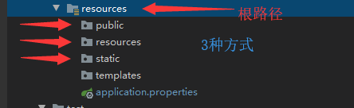
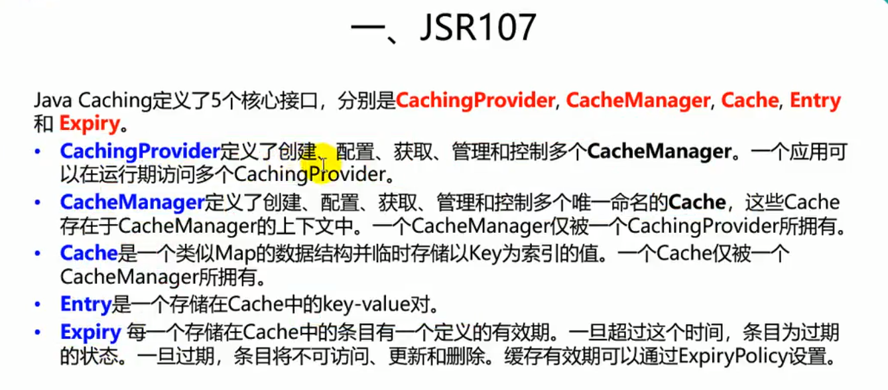

# Spring boot 相关知识

## Spring Boot Hello World

### 1.创建maven项目

### 2.导入相关Spring Boot 相关依赖

```xml
    <parent>
        <groupId>org.springframework.boot</groupId>
        <artifactId>spring-boot-starter-parent</artifactId>
        <version>2.2.1.RELEASE</version>
        <relativePath/>
    </parent>
	
    <dependencies>
        <dependency>
            <groupId>org.springframework.boot</groupId>
            <artifactId>spring-boot-starter-web</artifactId>
        </dependency>
    </dependencies>
```

### 3.编写主程序

```java
package club.zw12;

import org.springframework.boot.SpringApplication;
import org.springframework.boot.autoconfigure.SpringBootApplication;

@SpringBootApplication  //标注一个主程序类，说明他是一个spring Boot程序
public class HelloWorldApplication {
    public static void main(String[] args) {
        //Spring boot 应用启动起来
        SpringApplication.run(HelloWorldApplication.class,args);
    }
}
```

### 4.编写controller、service

```java
package club.zw12.controller;

import org.springframework.stereotype.Controller;
import org.springframework.web.bind.annotation.RequestMapping;
import org.springframework.web.bind.annotation.RequestMethod;
import org.springframework.web.bind.annotation.ResponseBody;

@Controller
public class HelloController {

    @ResponseBody
    @RequestMapping(value = "/hello", method = RequestMethod.GET)
    public String HelloWorld() {
        return "Hello World";
    }
}
```

### 5.运行应用


### 6.部署应用

创建可执行的jar包、在`pom.xml`文件中添加`plugin`插件

```xml
    <!--将应用打包成一个可执行jar包-->
    <build>
        <plugins>
            <plugin>
                <groupId>org.springframework.boot</groupId>
                <artifactId>spring-boot-maven-plugin</artifactId>
            </plugin>
        </plugins>
    </build>
```

选择`maven->Lifecycle->package`打包后的`jar`双击即可执行并访问

## spring boot 探究

### 导入父项目 

```xml
    <parent>
        <groupId>org.springframework.boot</groupId>
        <artifactId>spring-boot-starter-parent</artifactId>
        <version>2.2.1.RELEASE</version>
        <relativePath/>
    </parent>
父项目依赖于    
  <parent>
    <groupId>org.springframework.boot</groupId>
    <artifactId>spring-boot-dependencies</artifactId>
    <version>2.2.1.RELEASE</version>
    <relativePath>../../spring-boot-dependencies</relativePath>
  </parent>
他来真正管理Spring boot 的所有依赖版本
```

### 导入启动器

```xml
    <dependencies>
        <dependency>
            <groupId>org.springframework.boot</groupId>
            <artifactId>spring-boot-starter-web</artifactId>
        </dependency>
    </dependencies>
```

### spring-boot-starter-web

#### spring-boot-starter:

​		spring-boot,场景启动器，帮我们导入web模块正常运行所依赖的组件；

​		spring boot 将所有的功能场景抽取出来，做成一个个starters（启动器），只需要在项目里面引用这些starter相关的场景，所有依赖都会导入进来,要用什么功能，就导入什么场景的启动器。 

Starters可以理解为启动器，它包含了一系列可以集成到应用里面的依赖包，你可以一站式集成 Spring 及其他技术，而不需要到处找示例代码和依赖包。


 ## spring initialize 创建spring boot 工程

### 相关步骤

1. 选择spring boot 创建向导

2. 输入基本信息、选择jdk版本

3. 选择spring Boot的相关功能组件(选择我们需要的模块如：web、SQL等)

4. 输入工程名称

5. 创建完成

   

### 文件目录结构解析

resources文件夹下：

  - ==static==：静态文件。eg：js、css等。

  - ==templates==：保存所有模板页面(spring boot 默认jar使用嵌入式的tomcat，默认不支持jsp页面)；但是可以使用模板引擎、如：freemarker、thymeleaf 等。

  - ==application.properyties==:Spring Boot 应用的配置文件(可以修改一些默认设置)。

      - 修改端口号  

        ```properties
        server.port=8081
        ```

#### 注意事项

==@RestController==是==@Controller==和==@ResponseBody==的集合体

==@ResponseBody==在类上使用该注解即可实现返回的是==字符串==而不是==页面==

## 配置文件
	- YAML
	- properties


###  YAML

#### 基本语法

```yaml
server:
	path: /home
	port: 8081
```

==属性、值==大小写敏感

####  值得写法

- **k: v (冒号和value之间有空格)**
  
  - 字符串默认不用添加单引号或双引号
  - 双引号 "”:  "jwj \n comi” 输出：jwj ==换行== comi
  - 单引号 ‘’：‘jwj \n comi’ 输出：jwj comi
  
- **数组(list、set)**

  用 ==-==表示一个数组中的一个元素

```yaml
pets:
	- cat
	- dog
	- pig
```

- 行内语法
```yaml
pets: [dog,cat,pig]
```

- **对象、Map（属性和值、键值对）**
```yaml
friends：
	name: comi
	age: 18
```

- 行内写法

```yaml
friends:{name: comi,age: 18}
```

### 数据绑定

- 添加依赖（导入配置文件处理器，导入后便会有提示）

  ```xml
  <dependency>
       <groupId>org.springframework.boot</groupId>
       <artifactId>spring-boot-configuration-processor</artifactId>
       <optional>true</optional>
  </dependency>
  ```

  

- 创建bean

  添加==@Component==注解

  添加==@ConfigurationProperties(prefix="person”)==（告诉SpringBoot将本类中所有属性与配置文件中相关配置进行绑定）

  ​		==prefix==:指定哪一个配置与bean组件的属性进行绑定
  
   

- 在application.yml中书写配置

  

- 在properties中书写配置（二者选其一，若都存在，propertoes优先级高于yaml）

  若出现乱码需要在idea中设置`setting -> 搜索 file encoding `

  


- 单元测试

  在test类中可以进行自动注入

  

### @value和@ConfigurationProperties的区别

**单个值注入使用value**

**需要对应bean对象使用ConfigurationProperties**


### @PropertySource和@ImportResource

**@PropertySource**

​			如果所有配置文件都放在application.properties文件下，会导致文件过大，为此，我们可以新建一个properties文件。

​			eg：`person.properties`,这时便可以使用注解@propertySource引入我们的配置文件

```java
@PropertySource(value = {"classpath:person.properties"})
public class helloController {}
```

**@ImportResource**

> 导入spring的配置文件，让配置文件里面的内容生效。
>
> 在主应用程序上添加注解**@ImportResource(locations = {"classpath:bean.xml"})**

```java
@ImportResource(locations = {"classpath:bean.xml"})
@SpringBootApplication
public class DemoApplication {
    public static void main(String[] args) {
        SpringApplication.run(DemoApplication.class, args);
    }
}
```

### @Configuration

> SpringBoot推荐给容器中添加组件的方式：推荐使用==全注解==方式

@Configuration、@Bean均为spring底层知识点。

@Configuration 指明当前类是一个配置类，用来替代之前的spring配置文件。

@Bean给容器添加组件

```java
@Configuration
public class MyConfig{
    
    @Bean
    public HelloService helloService(){
        return new HelloService();
    }
}
```

### 配置文件占位符

1. 随机数

   ```java
   ${random.value}、${random.int}、${random.long}
   ${random.int(10)、${random.int[1204,65536]}
   ```
2. 占位符获取之前配置的值，如果没有，使用==：==指定默认值
	
	```properties
	person.last-name = 张三${random.uuid}
	person.dog.name = ${person.last-name: comi's}_dog
	#	获取person.last_name的值，如果没有值，则默认为comi's
	```

## Profile

### 多个profile文件

> profile是spring对不同环境提供不同配置功能的支持，可以通过激活、指定参数等方式快速切换环境。
>
> 我们在主配置文件编写时，文件名可以是`application-{profile}.properties.xml`

​	eg：

- 创建`application-dev.properties`

  - ```pr
    server.port=8082
    ```

  - 创建`application-prod.properties`

      - ```properties
        server.port=80
        ```

  - 默认未激活配置文件下，使用的是`application.properties`

      - ```properties
        server.port=8081
        spring.profiles.active=dev
        # 开启端口为8082
        ```

### yml 多文档块

#### 什么是文档块？

```yaml
# 默认使用
server：
	port: 8081
# 激活配置文件，使用dev环境
spring:
	profiles:
		active: dev
---		# 文档块分界线
# 文档块一,生产环境
server:
	port: 80
spring：
	profiles: dev
	
​```		# 文档块分界线

# 文档块二,开发环境
server:
	port:8082	
spring：
	profiles: prod
```

### 激活配置文件

1. spring.profiles.active=dev方式

2. 项目打包后使用命令行（cmd/Linux）方式运行

   ```cmake
   java -jar spring-boot.jar --spring.profiles.active=dev
   ```

### 配置文件加载位置

> spring-boot启动会扫描以下位置的`application.properties`或`application.yml`文件作为springboot的默认配置文件 

	- file：./congif/	 : 当前项目的  ==config==文件夹下
	- file:   ./      	  : 当前项目下
	- classpath: /config/ : resource文件夹即类路径下的config文件夹下
	- classpath: /        : 类路径下

> 以上文件夹==优先级==由高到低，高优先级配置会==覆盖==低优先级配置。但未配置的属性不会覆盖，而是会形成**互补配置**。

## SLF4J使用

> 在开发时，日志记录方法的调用，**不应该**直接调用日志的**实现类**，而是调用日志里面的**抽象方法**。
>
> 系统里需导入==slf4j==的jar和==logback==的实现jar。

> spring boot默认使用时slf4j和logback，能适配所有的日志，而且底层使用的slf4j+logback的方式记录日志，**引入其他框架时**，只需要把这个框架的日志框架排除掉即可。

### 配置lombok日志

引入依赖

```xml
        <!--lombok-->
        <dependency>
            <groupId>org.projectlombok</groupId>
            <artifactId>lombok</artifactId>
            <version>1.18.10</version>
        </dependency>
```

在需要输出日志的类上标注`@Slf4j`即可直接使用。

```java
            log.error("引擎激活失败");
```

   ### 日志使用

Spring Boot默认帮我们配置好了日志：

```java
package club.twzw.demo;

import org.slf4j.Logger;
import org.slf4j.LoggerFactory;
import org.springframework.boot.autoconfigure.SpringBootApplication;
import org.springframework.context.annotation.ImportResource;

@ImportResource(locations = {"classpath:bean.xml"})
@SpringBootApplication
public class DemoApplication {

    public static void main(String[] args) {

        Logger logger = LoggerFactory.getLogger(DemoApplication.class);
        //日志级别，由低到高
        logger.trace("用于跟踪轨迹");
        logger.debug("这是debug");
        logger.info("这是info");
        logger.warn("警告");
        logger.error("错误");
    }
}

```

**输出结果**:

​		未输出trance，说明spring boot的默认选项级别是debug及以上

```verilog
15:30:23.094 [main] DEBUG club.twzw.demo.DemoApplication - 这是debug
15:30:23.097 [main] INFO club.twzw.demo.DemoApplication - 这是info
15:30:23.097 [main] WARN club.twzw.demo.DemoApplication - 警告
15:30:23.097 [main] ERROR club.twzw.demo.DemoApplication - 错误
```

**可以在application.properties中配置日志级别**

```properties
logging.level.club.twzw=debug
# 日志输出文件，与path不共存，都有的话是name
logging.file.name=springboot.log
# 日志输出目录，项目路径下logs文件夹中
#logging.file.path=/logs/
```

指定配置文件：

> 在classpath目录下
>
> - 创建`logback.xml`文件，即可被spring框架所识别。
> - 创建`logback-spring.xml`：日志框架不直接加载日志的配置项，而是由spring boot解析日志配置。可以使用springboot的高级profile功能。

```xml
<layout class="ch.qos.logback.classic.PatternLayout">
	<springProfile name="dev">
	logging.pattern.console=$d{yyyy-mm-dd} % - dev
</springProfile>
    <springProfile name="!dev">
        logging.pattern.console=$d{yyyy-mm-dd} % - prod
    </springProfile>
</layout>
```

## web开发

1. 创建springBoot应用，选择模块-web，mybatis，redis等
2. 在配置文件中指定少量配置就可以运行
3. 编写业务代码

### 自动配置原理

- spring bootapplication注解中的auto configuration提供的功能
- autoconfiguration 核心就是导入了一个选择器EnableAutoConfigur ationImportSelector，通过选择器调用loadfacotryname读取所有含meta-inf/spring.factories的jar文件
- 将返回结果中的类通过反射创建对象，加入spring 容器

### springboot对静态资源映射规则

1. **/webjars/**路径

   > `classpath:/Meta-INF/Resources/webjars/`寻找资源所需资源只需要去 [webjars]: https://www.webjars.org/ 寻找maven，以maven的方式引用即可.
   
   - jquery
   
   ```xml
<dependency>
       <groupId>org.webjars</groupId>
       <artifactId>jquery</artifactId>
       <version>3.4.1</version>
   </dependency>
   ```
   
   **路由eg:**

   `localhost:8080/webjars/jquery.js`

2. /**路径

   **路由eg:**

   `localhost:8080/jquery.js` ->便会去静态资源文件夹中去找文件

   > 访问当前项目的任何资源（静态资源文件夹）。
   >
   > ```xml
   > "classpath:/META-INF/resources/"
   > “classpath:/resources/”
   > “classpath:/statis/”
   > “classpath:/public/”
   > “/”:当前项目的根路径
   > ```

   

3. 欢迎页配置，所有静态资源文件夹下的`index.html`

   **路由eg:**

   `localhost:8080/`寻找index.html文件

4. 网页标签的icon

   **favicon.ico**：都是在`**/favicon.ico`都是在静态资源文件夹下寻找

   

5. 修改**默认静态资源**文件夹

   ```properties
   spring.resources.static-location=classpath:/hello/,classpath:/world/
   ```


## 模板引擎

图例：


**spring boot 推荐thyneleaf(语法简单，功能强大)**

### **引入thyneleaf**

```xml
<dependency>
    <groupId>org.springframework.boot</groupId>
    <artifactId>spring-boot-starter-thymeleaf
    </artifactId>
</dependency>
```

#### **指定版本号**

```xml
<properties>
   <java.version>1.8</java.version>
   <properties>
     <thymeleaf.version>3.0.2.RELEASE</thymeleaf.version>
     <thymeleaf-layout-dialect.version>2.1.1</thymeleaf-layout-dialect.version>
    </properties>
</properties>
```

#### thyneleaf语法

待续

## spring boot自动配置spring mvc

引入thyneleaf依赖才可以使用viewResolver

```xml
        <dependency>
            <groupId>org.springframework.boot</groupId>
            <artifactId>spring-boot-starter-thymeleaf</artifactId>
        </dependency>
```

### **1. 默认配置**：

- `ContentNegotiaingViewResolver`和`BeanNameViewResolver`组件

  - 自动配置了viewResolver（视图解析器：更具返回值得到视图对象-view,视图决定如何渲染-转发/重定向）

  - `ContentNegotiaingViewResolver`:组合所有视图解析器

- 静态资源路径配置（见上面）

- 自动注册`Converter，GenericConverter，Formatter`组件

  - `Converter`:转换器->数据类型转换
  - `Formatter`:格式化器->2017/12/17—>Date

  **自己添加格式化器或转换器，只需要添加到容器中即可`@Bean`**

- `HttpMessageConverters`：消息转换器，Springmvc用来转换http请求和响应的。即接收参数/返回json对象等


- `MssageCideResolver`:定义错误代码生成规则。 

### **2.扩展springMVC**（视图映射，拦截等配置）

> 书写配置类，该配置类只处理页面请求，并返回页面

编写一个配置类（`@Configuration`），该类**继承**`WebMvcConfigureAdapter`（==推荐使用`WebMvcConfigurer`==）且不能标注@EnableWebMvc注解。

使用`WebMvcConfigureAdapter`来扩展springmvc的功能

```java
@Configuration
public class MYViewConfig extends WebMvcConfigureAdapter{
    //重写视图映射方法
    @Override
    public void addViewControllers(ViewControllerRegistry registry){ 
        registry.addViewController("/hello")
        .setViewName("hello");
    } 
}
```

这样便无需书写`@requestMapping("/hello”)`及`方法体等`。

#### WebMvcConfigurer案例

```java
@Configuration
public class myConfig implements WebMvcConfigurer {

    public void addViewControllers(ViewControllerRegistry registry) {
      registry.addViewController("/").setViewName("index");      		
      registry.addViewController("/index").setViewName("index");
   }

    @Bean
    public WebMvcConfigurer webMvcConfigurer() {
        WebMvcConfigurer configurer = new WebMvcConfigurer() {
            public void addViewControllers(ViewControllerRegistry registry) {
                registry.addViewController("/").setViewName("index");
                registry.addViewController("/index").setViewName("index");
            }
        };
        return configurer;
    }
}
```

###  **3.全面接管springmvc**（不推荐）

Springboot对springmvc的自动配置不用了，而是所有配置都是我们自己配置，只需要在配置类（`@Configuration`）中添加注解`@EnableWebMvc` 

### 如何修改SpringBoot的默认配置

1.  Springboot 在使用很多组件时，先看容器中有没有用户自己配置组件(@Bean,@Component)，如果有配置，就用用户的，反之，自动配置。如果有些组件有多个组件，则将用户配置和springboot的组合起来。
2. xxxxAutoConfiguration 帮助我们自动改配置

### 国际化

**使用**

> 在`resources`文件下创建`i18n`文件夹
>
> 1. 创建login文件夹
>
>    1. 创建`login.properties`文件
>    2. 创建`login_zh_CN.properties`文件
>
>    
>
> 2. 编写配置文件
>
>    1. 点击properties文件，底部选择Resource Bundle,点击添加，填写要国际化的部分
>
>       
>
> 3. springboot自动配置好了国际化管理的组件，所以我们需要配置`spring.messages.basename`,如果不配置，就会从类路径下去寻找`messages.properties`文件。
>
>    修改application.properties文件设置
>
>    ```properties
>    spring.messages.basename=i18n.login
>    ```
>
> 4. 页面获取国际化的值（thymeleaf模板引擎下）
>
>    ```html
>    <h1 th:text="#{login.username}"> </h1>
>    ```
>
> 5. 现在页面即可根据浏览器语言进行国际化

#### 创建自己的区域解析器，实现点击切换locale

创建类locale实现方法

```java
import org.springframework.web.servlet.LocaleResolver;
import org.thymeleaf.util.StringUtils;

import javax.servlet.http.HttpServletRequest;
import javax.servlet.http.HttpServletResponse;
import java.util.Locale;


public class local implements LocaleResolver {


    public Locale resolveLocale(HttpServletRequest httpServletRequest) {
        Locale locale = Locale.getDefault();
        String sLocale = httpServletRequest.getParameter("locale");
        if (!StringUtils.isEmpty(sLocale)){
            String[] split = sLocale.split("_");
            locale = new Locale(split[0] ,split[1]);
        }
        return locale;
    }

    public void setLocale(HttpServletRequest httpServletRequest, HttpServletResponse httpServletResponse, Locale locale) {

    }
}
```

在配置类中进行配置

```java
    @Bean
    public local myLocaleResolver(){
        return new local();
    }
```

现在就可以通过请求携带的参数进行更改显示语言了

### 修改页面并实时生效

1. 禁用模板引擎的缓存

   > spring.thymeleaf.cache=false

2. ctrl + F9 重新编译文件(idea)

## 拦截器

1. 书写类loginInterceptor实现`HandlerInterceptor`类

```java
import org.springframework.web.servlet.HandlerInterceptor;
import org.springframework.web.servlet.ModelAndView;

import javax.servlet.http.HttpServletRequest;
import javax.servlet.http.HttpServletResponse;

/**
 * 登陆检查
 */
public class loginInterceptor implements HandlerInterceptor {

    //目标方法执行之前
    public boolean preHandle(HttpServletRequest request, HttpServletResponse response, Object handler) throws Exception {
        Object user = request.getSession().getAttribute("loginUser");
        if (user != null) {
            return true;
        }
        System.out.println("被拦截！！！");
        request.getRequestDispatcher("/").forward(request, response);
        return false;
    }

    public void postHandle(HttpServletRequest request, HttpServletResponse response, Object handler, ModelAndView modelAndView) throws Exception {

    }

    public void afterCompletion(HttpServletRequest request, HttpServletResponse response, Object handler, Exception ex) throws Exception {

    }
}
```

2. 在配置文件中配置拦截器，是拦截器生效

```Java
public void addInterceptors(InterceptorRegistry registry) {
//拦截任意路径下的任意请求,除了登录页面的请求
    // 无需处理静态资源
 registry.addInterceptor(new loginInterceptor())
        .addPathPatterns("/**")
        .excludePathPatterns("/login","/");
}
```
## CRUD-restful

|      | 普通CRUD  | RestFul-crud |
| ---- | --------- | ------------ |
| 查询 | getEmp    | Emp—GET      |
| 添加 | AddEmp    | Emp—-POST    |
| 修改 | updateEmp | Emp—PUT      |
| 删除 | deleteEmp | Emp—DELETE   |

## springboot 错误处理机制及定制错误信息

> **原理：**
>
> 给容器中添加了以下组件
>
> - DefaultErrorAttributes：
>   - 帮我们在页面共享信息
> - BasicErrorController：
>   - 处理默认`/error`请求
> - ErrorPageCustomlizer
>   - 系统出现错误以后，来到`/error`进行处理
> - DefaultErrorViewResolver:
>   - 默认错误解析器

> **步骤：**
>
> 一但系统出现4xx，5xx（404，500）一系列错误，ErrorPageCustomlizer（定制错误相应规则）就会生效；随后便会请求`/error`，被BasicErrorController处理：
>
> - 响应页面：去哪个页面是由`DefaultErrorViewResolver`解析处理

> **定制错误响应：**
>
> 1. 如何定制错误响应页面？
>
>    1. 有模板引擎的情况下：error/状态码
>
>       将错误页面命名为错误状态码.html，放在error文件夹下（resources/templates/error/404.html），发生此状态码的错误就会跳转到对应页面。
>
>       > 同样可以使用4xx或5xx作为错误页面的文件名来匹配这种类型的所有错误，精确有限（优先寻找精确的状态买.html）
>       >
>       > 页面能获取的信息：
>       >
>       > 	-  timestamp：时间戳
>       > 	-  status：状态码
>       > 	-  error ：错误提示
>       > 	-  exception：异常对象
>       > 	-  message ：异常消息
>       > 	-  errors ：JSR303数据校验都在这里
>    
>    2. 没有模板引擎,就会在静态资源文件夹下找相应文件。
>    
>    3. 以上都没有错误，默认来到springboot的页面。
>
>
> 2. 如何定制json数据?
>    
>    1. 自定义exceptionHandler
>    
>       1. 创建类`exception`继承RuntimeException
>    
>       ```java
>       public class exception  extends RuntimeException{
>           public exception() {
>               super("用户不存在");
>           }
>       }
>       ```
>       2. 创建异常controller` 且自适应`。
>       ```java
>       @ControllerAdvice	//Aop增强
>       public class myexception {
>       
>           @ExceptionHandler(exception.class)
>           public String handlerException(Exception e, WebRequest request){
>               Map<String,Object> map = new HashMap<String, Object>();
>               request.setAttribute("javax.servlet.error.status_code",400,0);
>               map.put("code",100);
>               map.put("message",e.getMessage());
>               //在request-context存入数据
>               request.setAttribute("ext",map,0);
>               return "forward:/error";
>           }
>       }
>       ```
>    
>        3.  在需要时调用即可。
>    
>       ```java
>       throw new exception();
>       ```
>    
>    2. 定制页面数据显示并携带数据`DefaultErrorAttributes`
>    
>       1. ```java
>          @Component	//添入容器
>          public class myErrorAttributes extends DefaultErrorAttributes {
>                            
>              @Override
>              public Map<String, Object> getErrorAttributes(WebRequest webRequest, boolean includeStackTrace) {
>                  Map<String, Object> map = super.getErrorAttributes(webRequest, includeStackTrace);
>                  Map<String, Object> ext = (Map<String, Object>) webRequest.getAttribute("ext", 0);
>                  map.put("ext", ext);
>                  Logger logger = LoggerFactory.getLogger(myErrorAttributes.class);
>                  logger.info(String.valueOf(map));
>                  return map;
>              }
>          }
>          ```
>    
>       2. 现在就可以返回定制的json数据了

## 修改tomcat配置

1. 直接修改配置文件

   ```properties
   server.port=80
   server.servlet.context-path=/crud
   # 访问路径	http://localhost/crud/
   server.servlerPath=/
   # server.servlerPath来修改springmvc前端控制器默认拦截的请求路径
   ```

2. 嵌入式配置(太麻烦)

   ```java
       @Bean
       public WebServerFactoryCustomizer<ConfigurableWebServerFactory> factoryCustomizer(){
           return new WebServerFactoryCustomizer<ConfigurableWebServerFactory>() {
               @Override
               public void customize(ConfigurableWebServerFactory factory) {
                   factory.setPort(80);
               }
           };
       }
   ```

## 注册fliter，listener，servlet三大组件

- servlet：ServletRegistrationBean
- fliter：FilterRegistrationBean
- listener：ServletListenerRegistrationBean

在配置文件中添加三大组件

```java
    @Bean
    public FilterRegistrationBean myFilter()
    {
        FilterRegistrationBean registrationBean = new FilterRegistrationBean();
        registrationBean.setFilter(new myFilter());
        //设置拦截器 拦截/hello，/abc请求
        registrationBean.setUrlPatterns(Arrays.asList("/hello","/abc"));
        return registrationBean;
    }

    @Bean
    public ServletListenerRegistrationBean myListener()
    {
        ServletListenerRegistrationBean<myListener> registrationBean = new ServletListenerRegistrationBean<>(new myListener());

        return registrationBean;
    }

    @Bean
    public ServletRegistrationBean myServlet()
    {
        ServletRegistrationBean registrationBean = new ServletRegistrationBean(new myservelt());
        return registrationBean;
    }
```

myservelt.class

```java
import javax.servlet.*;
import java.io.IOException;

public class myservelt implements Servlet {
    @Override
    public void init(ServletConfig servletConfig) throws ServletException {

    }

    @Override
    public ServletConfig getServletConfig() {
        return null;
    }

    @Override
    public void service(ServletRequest servletRequest, ServletResponse servletResponse) throws ServletException, IOException {

    }

    @Override
    public String getServletInfo() {
        return null;
    }

    @Override
    public void destroy() {

    }
}

```

myListener.class

```java
import javax.servlet.ServletContextEvent;
import javax.servlet.ServletContextListener;

public class myListener implements ServletContextListener {
    @Override
    public void contextInitialized(ServletContextEvent sce) {

    }

    @Override
    public void contextDestroyed(ServletContextEvent sce) {

    }
}
```

myFilter.class

```java
import org.springframework.boot.web.servlet.FilterRegistrationBean;

import javax.servlet.*;
import java.io.IOException;

public class myFilter extends FilterRegistrationBean implements Filter {

    @Override
    public void init(FilterConfig filterConfig) throws ServletException {

    }

    @Override
    public void doFilter(ServletRequest servletRequest, ServletResponse servletResponse, FilterChain filterChain) throws IOException, ServletException {

    }

    @Override
    public void destroy() {

    }
}
```

## springboot 数据相关

### JDBC

application.yml配置文件

```yaml
spring:
  datasource:
    url: jdbc:mysql://47.xx.153.xx:3306/api
    name: api
    password: xxxxx
    driver-class-name: com.mysql.cj.jdbc.Driver
```

> 类路径下：直接通过sql文件建表-DataSourceInitializer:applicationListener

- runSchemaScripts()：运行建表语句

- runDataScripts()：运行插入数据的sql语句

  默认只需要将文件命名为：

  > schema-\*.sql , data-\*.sql

> 指定schema通过sql文件建表

```yaml
spring:
  datasource:
    schema: 
    	- classpath: department.sql
    	- classpath: api.sql
```

 ### **整合druid** 

引入依赖

```xml
<dependency>
    <groupId>com.alibaba</groupId>
    <artifactId>druid</artifactId>
    <version>1.1.21</version>
</dependency>
```

切换数据源

```yaml
spring:
  datasource:
    url: jdbc:mysql://47.xx.xx.41:3306/api
    name: api
    password: xxxxx
    driver-class-name: com.mysql.cj.jdbc.Driver
    type: com.alibaba.druid.pool.DruidDataSource
```

```properties
spring.datasource.url=jdbc:mysql://47.xx.xx.41:3306/api
spring.datasource.username=api
spring.datasource.password=xxxx
```

相关参数设置，与`name`同级，但此时无法设置参数，还需要将durid添加到容器中

创建类duridConfig

```java
import javax.sql.DataSource;

@Configuration
public class druidConfig {

    @ConfigurationProperties(prefix = "spring.datasource")
    @Bean
    public DataSource dataSource(){
        return new DruidDataSource();
    }
}
```

配置druid监控

```java
    //配置druid监控
    //1.配置一个管理后台的servlet
    @Bean
    public ServletRegistrationBean stateViewServlet(){
        ServletRegistrationBean bean = new ServletRegistrationBean(new StatViewServlet(),"/druid/*");
        Map<String,String> initParams = new HashMap<>();

        initParams.put("loginUsername","comi");
        initParams.put("loginPassword","146325");

        bean.setInitParameters(initParams);
        return bean;
    }

    //配置web监控的filter
    @Bean
    public FilterRegistrationBean webStateFilter(){
        FilterRegistrationBean bean = new FilterRegistrationBean();
        Map<String,String> initParams = new HashMap<>();
        bean.setFilter(new WebStatFilter());
        initParams.put("exclusions","*.js,*.css,/druid/*");

        bean.setInitParameters(initParams);
        bean.setUrlPatterns(Arrays.asList("/*"));//拦截请求设置
        return bean;
    }
```

配置成功后，便可以访问	http://localhost:8080/druid/login.html 进行登录操作

### 整合mybatis

引入依赖

```xml
        <dependency>
            <groupId>org.springframework.boot</groupId>
            <artifactId>spring-boot-starter-data-jdbc</artifactId>
        </dependency>
        <dependency>
            <groupId>org.springframework.boot</groupId>
            <artifactId>spring-boot-starter-web</artifactId>
        </dependency>
        <dependency>
            <groupId>org.mybatis.spring.boot</groupId>
            <artifactId>mybatis-spring-boot-starter</artifactId>
            <version>2.1.1</version>
        </dependency>

        <dependency>
            <groupId>mysql</groupId>
            <artifactId>mysql-connector-java</artifactId>
            <scope>runtime</scope>
        </dependency>
		<!--整合druid-->
        <dependency>
            <groupId>com.alibaba</groupId>
            <artifactId>druid</artifactId>
            <version>1.1.21</version>
        </dependency>
```
#### 注解

> 使用mapper注解即可使用mybatis语法
>
> 获取插入后的自增id

```java
@Mapper
public class user {

    @Select("select * from users");
    public List<user> getAllUsers();
    
    @Options(useGenerateKeys=true,ketProperty="id")
    @Insert("insert into users(name,password)values(#		{param1},#{param2})")
    publc int insertUser(String name,Integer password)
}
```

 自定义mybatis配置规则

```java
@Configuration
public class mybatis {

    @Bean
    public ConfigurationCustomizer configurationCustomizer(){
        return new ConfigurationCustomizer() {
            @Override
            public void customize(org.apache.ibatis.session.Configuration configuration) {
               //开启驼峰命名等
                configuration.setMapUnderscoreToCamelCase(true);
            }
        };
    }
}
```

> 开启mapper包扫描，批量扫描mapper接口`@MapperScan`，就不需要再每个mapper上注解mapper
>
> ```java
>   @MapperScan(value="com.example.mybatis.mapper”)
>   ```

   #### xml

1. 创建mybatis全局配置文件`mybatis-config.xml`

3. 书写全局配置文件-开启驼峰命名等

   ```xml-dtd
   <?xml version="1.0" encoding="UTF-8"?>
   <!DOCTYPE configuration PUBLIC "-//mybatis.org//DTD Config 3.0//EN"
        "http://mybatis.org/dtd/mybatis-3-config.dtd" >
   <configuration>
       <settings>
           <setting name="mapUnderscoreToCameCase" value="true"/>
       </settings>
   </configuration>
   ```
   
3. 书写sql映射

   ```xml-dtd
   <?xml version="1.0" encoding="UTF-8"?>
   <!DOCTYPE mapper PUBLIC "-//mybatis.org//DTD Mapper 3.0//EN"
           "http://mybatis.org/dtd/mybatis-3-mapper.dtd">
   <mapper namespace="club.twzw.mapper.EmployeeMapper">
       <select id="getEmpByid" resultMap="int">
           select * form emps;
       </select>
   </mapper>
   ```

4. 指定全局配置文件位置和sql映射文件位置

      ```properties
   mybatis:
      	config-location: classpath:mybatis/mybatis-config.xml
      	mapper-location: classpath:mybatis/mapper/*.xml
   ```

### 整合JPA

地址： https://www.bilibili.com/video/av38657363?p=67 

## Spring Boot启动配置原理

地址：https://www.bilibili.com/video/av38657363?p=68

## 缓存

> 缓存作用：保存临时数据（`验证码`）或高频访问数据（`电商网站商品`）

### **JSR107**




导入依赖

```xml
<dependency>
	<groupid>javax.cache</groupid>
    <artifactId>cache-api</artifactId>
</dependency>
```

### Spring 缓存抽象

#### 重要概念和缓存注解

| Cache          | 缓存接口，定义缓存操作。实现：RedisCache,EhCacheCache等      |
| -------------- | ------------------------------------------------------------ |
| CacheMannager  | 缓存管理器，管理各种缓存（Cache）组件                        |
| keyGenerator   | 缓存数据时key生成策略                                        |
| serialize      | 缓存数据时Value序列化策略                                    |
| @Cacheable     | 主要针对方法，能够根据方法的请求参数对方法`返回结果`进行缓存（若缓存中没有结果，便添加缓存，否则不添加） |
| @CacheEvict    | 清空缓存（删除用户同时删除缓存）                             |
| @CachePut      | 更新缓存（更新用户同时更新缓存）                             |
| @EnableCaching | 开启基于注解的缓存                                           |

#### 使用注解

在主类上标注`@EnableCaching`

##### @Cacheable注解

```java
@Cacheable(cacheName={"emp","temp"},key="#id")//可以指定一个或多个缓存中,key指的是以参数id的值为key
	public Employee getEmp(Integet id){
        System.out.print("查询了第"+id+"号员工");
        Employee emp = empService.getEmpById(id);
        return emp;
    }
```

参数：

- **cacheName**：指定缓存组件的名字

- **keyGenerator**：key的生成器，与key二选一
  
  - **CacheMannager**：指定缓存管理器
- **condition**：指定符合条件的情况下才缓存。`condition = “#id>0”`
  
  - **unless**:当unless指定的条件为真，方法的返回值就不会被缓存`unless="#result==null"`
- **sync**：是否使用异步,如果使用，unless就不支持

原理及运行步骤：


##### @CachePut注解

- 即调用方法，又缓存数据
- 先调目标方法，再将目标方法的返回结果存入缓存
- 其他属性和@cacheable相同

```java
    @GetMapping("/update")
    @CachePut(value = "users",key="#users.id")
    public String update(users users){	
        return String.valueOf(mapper.updateUserInfo(users));
    }
```

达到同步效果：存缓存的key和取缓存的key为相同的key，即

```java
@Cacheable(cacheNames="users",key="#id")
@CachePut(value = "users",key="#users.id")
#id 和 #users.id 为同一个key
```

##### @CacheEvict注解，缓存清除

- allEntries = true：清除缓存所有数据
- beforeInvocation = true ：在方法执行之前清除缓存，即方法处理时出现异常，缓存中也不会有数据。

```java
    @GetMapping("/delete")
    @CacheEvict(value = "users",key = "#id")
    public String delete(Integer id){
        System.out.println("删除用户："+id);
        return "success";
    }
```

##### @Caching注解，使用多个缓存注解

- 通过多种属性去查一个员工的情况

- ```java
        @GetMapping("/byCondition")
        @Caching(
                cacheable = {@Cacheable(key = "#string")},
                put = {
                        @CachePut(key = "#result.name"),
                        @CachePut(key = "#result.email"),
                }
    
        )
        public String byCondition(String string){
            users users = service.findBycontidition(string);
            return users;
        }
    ```

##### `@CacheCongfig注解`公共配置注解

- 在**类**上使用，使用后均无需再chche的注解上再去标注cache的value

- ```java
    @CacheConfig(cacheNames="emp")
    ```

### 整合redis作为缓存

>  redis 常见数据类型String（字符串）、List（列表）、Set（集合）、Hash（散列）、Zset(有序集合)

引入依赖

```xml
      <groupId>org.springframework.boot</groupId>
            <artifactId>spring-boot-starter-data-redis</artifactId>
            <version>2.2.2.RELEASE</version>
      </dependency>
```

配置redis

```properties
spring.redis.host=xx.xx.xx.xx
```

调用redis

 - StringRedisTemplate

    - ```java
      redisTemplate.opsForValue().append("msg","hello");
      sout(redisTemplate.opsForValue().get("msg"));
      ```

##### redis序列化存入json数据或字符串而不是序列化的码

1：使用map

2.

使用`FASTJSON`

引入依赖

```xml
        <dependency>
            <groupId>com.alibaba</groupId>
            <artifactId>fastjson</artifactId>
            <version>1.2.62</version>
        </dependency>
```

​	`Primary注解：`将某个缓存处理器作为默认的 

1. bean对象实现序列化

   ```java
   @Component
   public class users implements Serializable {
       private Integer id;
       private String name;
       private char sexual;
       private String password;
       private Integer integral;
       private Integer total;
       private Integer user_status;
       private String signature;
   
       public Integer getId() {
           return id;
       }
   
       public void setId(Integer id) {
           this.id = id;
       }
   
       public String getName() {
           return name;
       }
   
       public void setName(String name) {
           this.name = name;
       }
   
       public char getSexual() {
           return sexual;
       }
   
       public void setSexual(char sexual) {
           this.sexual = sexual;
       }
   
       public String getPassword() {
           return password;
       }
   
       public void setPassword(String password) {
           this.password = password;
       }
   
       public Integer getIntegral() {
           return integral;
       }
   
       public void setIntegral(Integer integral) {
           this.integral = integral;
       }
   
       public Integer getTotal() {
           return total;
       }
   
       public void setTotal(Integer total) {
           this.total = total;
       }
   
       public Integer getUser_status() {
           return user_status;
       }
   
       public void setUser_status(Integer user_status) {
           this.user_status = user_status;
       }
   
       public String getSignature() {
           return signature;
       }
   
       public void setSignature(String signature) {
           this.signature = signature;
       }
   
       @Override
       public String toString() {
           return "{ id:" + id
                   + ",name:" + name
                   + ",sexual:" + sexual
                   + ",password:" + password
                   + ",integral:" + integral
                   + ",total:" + total
                   + ",status:" + user_status
                   + ",signature:" + signature
                   + "}";
       }
   }
   ```

   

2. 书写redis的配置文件

   1.  ```java
         
      @Configuration
      public class redisConfig {
      
      
          @Bean
          public RedisTemplate<Object, Object> redisTemplate(RedisConnectionFactory redisConnectionFactory) {
              RedisTemplate<Object, Object> template = new RedisTemplate<>();
              template.setConnectionFactory(redisConnectionFactory);
      
              FastJsonRedisSerializer<Object> serializer = new FastJsonRedisSerializer<Object>(Object.class);
              // value值的序列化采用fastJsonRedisSerializer
              template.setValueSerializer(serializer);
              template.setHashValueSerializer(serializer);
              // key的序列化采用StringRedisSerializer
              template.setKeySerializer(new StringRedisSerializer());
              template.setHashKeySerializer(new StringRedisSerializer());
      
              template.setConnectionFactory(redisConnectionFactory);
              return template;
          }
      
      
          @Bean
          public RedisCacheManager redisCacheManager(RedisTemplate<Object, Object> redisTemplate) {
              RedisCacheWriter redisCacheWriter = RedisCacheWriter.nonLockingRedisCacheWriter(redisTemplate.getConnectionFactory());
              RedisCacheConfiguration redisCacheConfiguration = RedisCacheConfiguration.defaultCacheConfig()
                      .serializeValuesWith(RedisSerializationContext.SerializationPair.fromSerializer(redisTemplate.getValueSerializer()));
              return new RedisCacheManager(redisCacheWriter, redisCacheConfiguration);
          }
      
      }
      ```
      
   2. 调用序列化器

      ```java
         	//方法一
      	@Autowired
          private RedisTemplate<Object,Object> redisTemplate1;
      
          @Test
          void contextLoads() {
              ArrayList<users> users = mapper.getAllUsers();
              redisTemplate1.opsForValue().set("user",users.get(0));
          }
      
      	//controller调用
          @RequestMapping("/getAllUsers/{id}")
          @Cacheable(value = "users",key = "#id")
          public String getAllUsers(@PathVariable(name = "id") Integer id) {
      
              ArrayList<users> allUsers = service.getAllUsers();
      
              return JSONObject.toJSONString(allUsers);
          }
      ```

   3. out

      ```json
      # 方法一
      {
        "id": 1,
        "name": "comiii",
        "sexual": "男",
        "password": "123456",
        "integral": 359,
        "total": 11,
        "user_status": -2,
        "signature": "原谅我一身放荡不羁爱自由！"
      }
      # 控制器调用
      "{\"id\":1,\"integral\":359,\"name\":\"comiii\",\"password\":\"12xx6\",\"sexual\":\"男\",\"signature\":\"原谅我一身放荡不羁爱自由！\",\"total\":11,\"user_status\":-2}"
      ```

## 消息

> 应用场景
>
>  - 秒杀：10万人抢1万件商品，如果消息队列满了，则直接返回秒杀失败，随后秒杀业务才从**消息队列**中取出消息。
>  - 异步处理：应用注册场景下，一旦数据写入数据库，直接返回注册成功，而后的`身份验证等`由业务逻辑去读取**消息队列**。
>  - 应用节偶：订单系统添加订单到**消息队列**，库存系统读取消息队列。

### 重要概念

> 消息代理、目的地：当消息发送者发送消息以后，将有`消息代理`(服务器)接管，消息代理保证信息传递到指定`目的地`（系统）。

**目的地主要有两种形式的目的地：**

- 队列：点对点消息通信
  - 消息发送者发送消息，消息代理将其放入一个队列中，信息接收者从队列中获取消息内容，消息读取后移除队列。
  - 消息只能由唯一的发送者和接收者，可以有多个接收者。
- 主题：发布/订阅消息通信
  - 发送者发送消息到主题，多个接收者监听这个主题，那么就会在消息到达时同时收到消息。

### RabbitMQ

#### 概念

- `Messgae`：由消息头和消息体组成。消息体不透明，而消息头由可选属性组成。

  可选属性：

  - routing-key：路由键
  - priority：相对于其他信息的优先权。
  - delivery-mode：指出该消息可能需要持久化等。

- `publisher`：消息的生产者，也是向交换器发布消息的客户端应用程序。

- `exchange`：交换器，用于接收生产者的消息并将这些消息路由给服务器中的队列。

  四种类型：

  - direct：默认，点对点模型
  - fanut：发布订阅模型
  - topic：发布订阅模型
  - headers：发布订阅模型

- `Queue`：消息队列，用来保存消息直到发送给消费者。它是消息的容器。一个消息可以投入一个或多个队列。

- `Binding`：绑定，用于消息队列和交换器之间的关联。一个绑定就是介于路由键将交换器和消息队列连接起来的路由规则，所以可以将交换器理解成一个由绑定构成的路由器。

  - exchange和queue的绑定可以是多对多的关系。
  
- `connection`：网络连接，TCP连接

- `Channel`：信道，多路**复用**连接中的一条独流的双向数据流通道。信道是建立在真实的**TCP**连接内的虚拟连接，不管是**发布消息**还是**订阅队列**还是**接收消息**都是通过信道完成。

- `Consumer`：消息的消费者，表示一个从消息队列中取出消息的客户端应用程序。

- `Virtual Host`：虚拟主机，表示一批交换器、消息队列和相关对象。本质上就是mini般的RabbitMQ服务器，拥有自己的队列，交换器，绑定和权限机制，通过指定`路由`访问：`/、/getUsers`等

- `Broker`：表示消息队列的`服务器`实体。


#### 运行机制

##### Exchange 类型

>  Direct：直连型，只有路由完全一样时，才会转发。


> Fanout：每个发到fanout类型交换器的消息都会分到所有绑定的队列上去。类似于广播，每台子网内的主机都获得一份复制信息，该类型转发消息是最快的。 


> Topic：通过`模式匹配`分配消息的路由键属性,将`路由器和某个模式`进行匹配，此时队列需要绑定到一个模式上。
>
> 通配符：#、*
>
> #：匹配0个或多个**单词**
>
> *：匹配一个**单词**


#### 安装RabbitMQ

1. docker search rabbitmq
2. docker pull rabbitmq:3-management
3. docker run -d -p 5672:5672 -p 15672:15672 --name RabbitMQ image-id
4. ip:15672访问；用户名guest，密码guest

#### 整合RabbitMQ

 引入依赖

```xml
        <dependency>
            <groupId>org.springframework.boot</groupId>
            <artifactId>spring-boot-starter-amqp</artifactId>
        </dependency>
```

配置文件

```properties
spring.rabbitmq.host=47.xxx.xxx.xxx
spring.rabbitmq.username=guest
spring.rabbitmq.password=guest
```

**简单案例:发送和接收消息**

```java
    @Autowired
    RabbitTemplate rabbitTemplate;

    @Test
    void contextLoads() {
        rabbitTemplate.convertAndSend("update.fanout","/","anything!");
    }

    @Test
    void receive(){
        Object receive = rabbitTemplate.receiveAndConvert("orders");
        System.out.println(receive);
    }
```

**存入json消息**:自定义配置

```java
@Configuration
public class myRabbitMQ {

    @Bean
    public MessageConverter messageConverter(){
        return new Jackson2JsonMessageConverter();
    }
}
```

 ```java
    @Autowired
    RabbitTemplate rabbitTemplate;

    @Test
    void contextLoads() {
        rabbitTemplate.convertAndSend("update.direct", "update.direct.news", "{ \"name\":\"comi\",\n \"age\":18\n }");
    }

    @Test
    void receive() {
        Object receive = rabbitTemplate.receiveAndConvert("news");
        System.out.println(receive);
    }
 ```

json 结合bean

1. 创建bean对象、需要无参、有参、set、get方法

   ```java
   public class user {
       private String name;
       private Integer age;
   
       public user() {
       }
   
       public user(String name, Integer age) {
           this.name = name;
           this.age = age;
       }
   
       public String getName() {
           return name;
       }
   
       public void setName(String name) {
           this.name = name;
       }
   
       public Integer getAge() {
           return age;
       }
   
       public void setAge(Integer age) {
           this.age = age;
       }
   }
   ```

2. 调用

    ```java
       @Autowired
       RabbitTemplate rabbitTemplate;
      
       @Test
       void contextLoads() {
           rabbitTemplate.convertAndSend("update.direct", "update.direct.news", new user("comi", 18));
       }
      
       @Test
       void receive() {
           Object receive = rabbitTemplate.receiveAndConvert("news");
           System.out.println(receive);
       }
    ```

#### 消息队列监听

`@RebbitListenner(queues = "news")`：消息队列监听注解、只要消息队列中有内容进来，该注解下的方法便会被调用。

```java
@Service
public class UserService {

    @RabbitListener(queues = "news")
    public void listener(user u){
        System.out.println("收到消息：" + u.getName() +","+ u.getAge());
    }
}
```

主程序开启支持rabbitmq支持

```java
@EnableRabbit //开启基于注解的rabbitmq
@SpringBootApplication
public class RabbitmqApplication {

    public static void main(String[] args) {
        SpringApplication.run(RabbitmqApplication.class, args);
    }

}
```

当web程序启动后，一旦消息队列收到消息，便会自动取出消息队列中的消息。

##### AmqpAdmin动态添加exchange交换器和queue队列

> AmqpAdmin : 创建和删除Queue、exchange、Binding

```java
    @Test
    public void CreateExchange() {
        admin.declareExchange(new DirectExchange("amqp.exchange"));
        System.out.println("创建交换器完成！");
    }

    @Test
    public void declareQueue() {
        admin.declareQueue(new Queue("amqp.queue"));
        System.out.println("创建队列完成！");
    }

    @Test
    public void declareBinding() {
        Binding binding = new Binding("news", Binding.DestinationType.QUEUE, "amqp.exchange", "amqp.queue", null);
        admin.declareBinding(binding);
        System.out.println("创建绑定完成！");
    }

    @Test
    public void removeBinding() {

        Binding binding = new Binding("news", Binding.DestinationType.QUEUE, "amqp.exchange", "amqp.queue", null);
        admin.removeBinding(binding);
        System.out.println("删除绑定完成！");
    }
```

#### 消息确认机制

> 如何确认消息发送后是否到达rabbitmq服务器？（默认不知道）

两种方式：

- AMQP实现了事务机制
- Confirm模式

##### 事务机制

> 我们在channel对象中可以看到` txSelect(),txCommit(),txrollback()` 这些方法，分别对应着开启事务，提交事务，回滚。由于使用事务会造成生产者与Broker交互次数增加，造成性能资源的浪费，而且事务机制是阻塞的，`在发送一条消息后需要等待RabbitMq回应，之后才能发送下一条`，因此事务机制不提倡，大家在网上也很少看到RabbitMq使用事务进行消息确认的。

#### confirm模式

>  channel。confirmSelect()设置为confirm模式。//与事务相冲突

- 普通模式，发一条确认消息，waitForConfirms();
  - 发送一次确认一次
- 批量确认，确认多条消息，waitForConfirms();
  - 发送多条，再确认
- 异步comnfirm模式，提供一个回调方法
  - 


## 检索

安装

```powershell
> docker search elasticsearch
> docker pull  docker pull docker.io/elasticsearch:6.5.0
> docker run -e ES_JAVA_OPTS="-Xms256m -Xmx256m" -d -p 9200:9200 -p 9300:9300 --name ELS elasticsearch:6.5.0
# 设置默认启动占用内存256M，9300端口为分布式节点端口
```

## 任务

### 异步任务

> 可以有效缓解任务处理带来的加载缓慢的体验

1. 开启异步任务注解

   ```java
   @EnableAsync //开启异步任务注解
   @SpringBootApplication
   public class TaskApplication {
   
       public static void main(String[] args) {
           SpringApplication.run(TaskApplication.class, args);
       }
   
   }
   ```

2. 在需要异步任务(邮件任务)的service上进行标注开启异步任务 `@Async`

   ```java
   @Service("myService")
   public class myService {
   
       @Async
       public void hello(){
           try {
               Thread.sleep(3000);
           } catch (InterruptedException e) {
               e.printStackTrace();
           }
           System.out.println("任务处理中。。。");
       }
   }
   ```

### 定时任务

> 用于每月定时的`日志分析收集、客房住户分析`等。

#### cron表达式格式

{秒数} {分钟} {小时} {日期} {月份} {星期} {年份(可为空)}

`@Scheduled(cron = "0 0 24 1 * ?")`：每月的1号24：00启动任务

1. 开启定时任务

    ```java
   @EnableScheduling
   @SpringBootApplication
   public class TaskApplication {
   
       public static void main(String[] args) {
           SpringApplication.run(TaskApplication.class, args);
       }
   
   }
   ```

2. 设置启动任务时间

   ```java
   @Service
   public class scheduleService {
   
       @Scheduled(cron = "0 0 24 1 * ?")
       public void hello() {
           System.out.println("日志收集");
       }
   }
   ```

### 邮件任务

1. 引入依赖

   ```xml
           <dependency>
               <groupId>org.springframework.boot</groupId>
               <artifactId>spring-boot-starter-mail</artifactId>
           </dependency>
   ```

2. 配置文件设置mail属性

   ```properties
   spring.mail.username=xxxxxxx@qq.com
   spring.mail.password=xxxxxxxxxx
   spring.mail.host=smtp.qq.com
   spring.mail.properties.mail.smtp.ssl.enable=true
   ```

3. 简单邮件发送

   ```java
   @Autowired
       JavaMailSenderImpl javaMailSender;
   
       @Test
       void contextLoads() {
           SimpleMailMessage message = new SimpleMailMessage();
           message.setSubject("今晚开会");
           message.setText("今晚开会");
           message.setTo("xxxxxx@gmail.com");
           message.setFrom("xxxxxx@qq.com");
           javaMailSender.send(message);
       }
   ```

4. 复杂邮件：携带样式发送邮件

   ```java
       @Test
       void test() throws MessagingException {
           MimeMessage message = javaMailSender.createMimeMessage();
           MimeMessageHelper helper = new MimeMessageHelper(message,true);
   
           helper.setText("今晚开会");
           helper.addAttachment("11.jpg", new File("C:\\Users\\Administrator\\Desktop"));
   
           helper.setTo("xxxx@qq.com");
           helper.setFrom("xxxx@qq.com");
           javaMailSender.send(message);
       }
   ```

## 安全

> 身份认证、安全控制、权限控制、漏洞攻击

1. 引入springboot security

   ```xml
           <dependency>
               <groupId>org.springframework.boot</groupId>
               <artifactId>spring-boot-starter-security</artifactId>
           </dependency>
   ```

2. 编写spring security的配置类

   ```java
   @EnableWebSecurity
   public class security extends WebSecurityConfigurerAdapter {
   
       @Override
       protected void configure(HttpSecurity http) throws Exception {
   
   
           // 定制请求的授权规则,设置访问路径
           http.authorizeRequests().antMatchers("/").permitAll().
                   antMatchers("/hello/**").hasRole("manage")
                   .antMatchers("/write/**").hasRole("user");
   
           //开启自动配置的登录功能
           /*
            * 1./login 登陆页面
            * 2./login?error 登陆错误
            */
           http.formLogin();
   
           // 开启自动配置的注销功能
           /*
            * 访问/logout请求，清空session
            * 跳转到/login?logout
            *
            */
           http.logout().logoutSuccessUrl("/");
       }
   
       @Override
       protected void configure(AuthenticationManagerBuilder auth) throws Exception {
   
           auth.inMemoryAuthentication().passwordEncoder(new BCryptPasswordEncoder())
                   .withUser("comi").password(new BCryptPasswordEncoder().encode("123456")).roles("manage", "user")
                   .and()
                   .withUser("siki").password(new BCryptPasswordEncoder().encode("123456")).roles("user");
       }
   
   }
   
   ```

### cookies

```java
        //cookies  开启记住我功能
        http.rememberMe();
```

### 定制登录页

```java
        http.formLogin().loginPage("/login").successForwardUrl("/");
```

## Jpa

### 预先生成方法

Spring Boot Jpa 默认预先生成了一些基本的CURD的方法，例如：增、删、改等等

1 继承 JpaRepository

```java
public interface UserRepository extends JpaRepository<User, Long> {
}
```

2 使用默认方法

```java
@Test
public void testBaseQuery() throws Exception {
	User user=new User();
	userRepository.findAll();
	userRepository.findOne(1l);
	userRepository.save(user);
	userRepository.delete(user);
	userRepository.count();
	userRepository.exists(1l);
	// ...
}
```

### 自定义简单查询

自定义的简单查询就是根据方法名来自动生成 SQL，主要的语法`findXXBy`,`readAXXBy`,`queryXXBy`,`countXXBy`, `getXXBy`后面跟属性名称：

```java
User findByUserName(String userName);
```

也使用一些加一些关键字`And`、 `Or`

```java
User findByUserNameOrEmail(String username, String email);
```

修改、删除、统计也是类似语法

```java
Long deleteById(Long id);
Long countByUserName(String userName)
```

基本上 SQL 体系中的关键词都可以使用，例如：`LIKE`、 `IgnoreCase`、 `OrderBy`。

```java
List<User> findByEmailLike(String email);
User findByUserNameIgnoreCase(String userName);
List<User> findByUserNameOrderByEmailDesc(String email);
```

**jpa方法名关键字**

| Keyword           | Sample                                  | JPQL snippet                                                 |
| ----------------- | --------------------------------------- | ------------------------------------------------------------ |
| And               | findByLastnameAndFirstname              | … where x.lastname = ?1 and x.firstname = ?2                 |
| Or                | findByLastnameOrFirstname               | … where x.lastname = ?1 or x.firstname = ?2                  |
| Is,Equals         | findByFirstnameIs,findByFirstnameEquals | … where x.firstname = ?1                                     |
| Between           | findByStartDateBetween                  | … where x.startDate between ?1 and ?2                        |
| LessThan          | findByAgeLessThan                       | … where x.age < ?1                                           |
| LessThanEqual     | findByAgeLessThanEqual                  | … where x.age ⇐ ?1                                           |
| GreaterThan       | findByAgeGreaterThan                    | … where x.age > ?1                                           |
| GreaterThanEqual  | findByAgeGreaterThanEqual               | … where x.age >= ?1                                          |
| After             | findByStartDateAfter                    | … where x.startDate > ?1                                     |
| Before            | findByStartDateBefore                   | … where x.startDate < ?1                                     |
| IsNull            | findByAgeIsNull                         | … where x.age is null                                        |
| IsNotNull,NotNull | findByAge(Is)NotNull                    | … where x.age not null                                       |
| Like              | findByFirstnameLike                     | … where x.firstname like ?1                                  |
| NotLike           | findByFirstnameNotLike                  | … where x.firstname not like ?1                              |
| StartingWith      | findByFirstnameStartingWith             | … where x.firstname like ?1 (parameter bound with appended %) |
| EndingWith        | findByFirstnameEndingWith               | … where x.firstname like ?1 (parameter bound with prepended %) |
| Containing        | findByFirstnameContaining               | … where x.firstname like ?1 (parameter bound wrapped in %)   |
| OrderBy           | findByAgeOrderByLastnameDesc            | … where x.age = ?1 order by x.lastname desc                  |
| Not               | findByLastnameNot                       | … where x.lastname <> ?1                                     |
| In                | findByAgeIn(Collection ages)            | … where x.age in ?1                                          |
| NotIn             | findByAgeNotIn(Collection age)          | … where x.age not in ?1                                      |
| TRUE              | findByActiveTrue()                      | … where x.active = true                                      |
| FALSE             | findByActiveFalse()                     | … where x.active = false                                     |
| IgnoreCase        | findByFirstnameIgnoreCase               | … where UPPER(x.firstame) = UPPER(?1)                        |

### 复杂查询

在实际的开发中我们需要用到分页、删选、连表等查询的时候就需要特殊的方法或者自定义 SQL

**分页查询**

分页查询在实际使用中非常普遍了，Spring Boot Jpa 已经帮我们实现了分页的功能，在查询的方法中，需要传入参数`Pageable` ,当查询中有多个参数的时候`Pageable`建议做为最后一个参数传入.

```java
Page<User> findALL(Pageable pageable);
Page<User> findByUserName(String userName,Pageable pageable);
```

`Pageable` 是 Spring 封装的分页实现类，使用的时候需要传入页数、每页条数和排序规则

```java
@Test
public void testPageQuery() throws Exception {
	int page=1,size=10;
	Sort sort = new Sort(Direction.DESC, "id");
    Pageable pageable = new PageRequest(page, size, sort);
    userRepository.findALL(pageable);
    userRepository.findByUserName("testName", pageable);
}
```

**限制查询**

有时候我们只需要查询前N个元素，或者支取前一个实体。

```java
User findFirstByOrderByLastnameAsc();
User findTopByOrderByAgeDesc();
Page<User> queryFirst10ByLastname(String lastname, Pageable pageable);
List<User> findFirst10ByLastname(String lastname, Sort sort);
List<User> findTop10ByLastname(String lastname, Pageable pageable);
```

### 自定义SQL查询

其实 Spring Data 觉大部分的 SQL 都可以根据方法名定义的方式来实现，但是由于某些原因我们想使用自定义的 SQL 来查询，Spring Data 也是完美支持的；在 SQL 的查询方法上面使用`@Query`注解，如涉及到删除和修改在需要加上`@Modifying`.也可以根据需要添加 `@Transactional`对事物的支持，查询超时的设置等。

```java
@Modifying
@Query("update User u set u.userName = ?1 where u.id = ?2")
int modifyByIdAndUserId(String  userName, Long id);
	
@Transactional
@Modifying
@Query("delete from User where id = ?1")
void deleteByUserId(Long id);
  
@Transactional(timeout = 10)
@Query("select u from User u where u.emailAddress = ?1")
User findByEmailAddress(String emailAddress);
```

### 多表查询

多表查询 Spring Boot Jpa 中有两种实现方式，第一种是利用 Hibernate 的级联查询来实现，第二种是创建一个结果集的接口来接收连表查询后的结果，这里主要第二种方式。

首先需要定义一个结果集的接口类。

```java
public interface HotelSummary {

	City getCity();

	String getName();

	Double getAverageRating();

	default Integer getAverageRatingRounded() {
		return getAverageRating() == null ? null : (int) Math.round(getAverageRating());
	}

}
```

查询的方法返回类型设置为新创建的接口

```java
@Query("select h.city as city, h.name as name, avg(r.rating) as averageRating "
		- "from Hotel h left outer join h.reviews r where h.city = ?1 group by h")
Page<HotelSummary> findByCity(City city, Pageable pageable);

@Query("select h.name as name, avg(r.rating) as averageRating "
		- "from Hotel h left outer join h.reviews r  group by h")
Page<HotelSummary> findByCity(Pageable pageable);
```

使用

```
Page<HotelSummary> hotels = this.hotelRepository.findByCity(new PageRequest(0, 10, Direction.ASC, "name"));
for(HotelSummary summay:hotels){
		System.out.println("Name" +summay.getName());
	}
```

> 在运行中 Spring 会给接口（HotelSummary）自动生产一个代理类来接收返回的结果，代码汇总使用 `getXX`的形式来获取

### 多数据源的支持

### 同源数据库的多源支持

日常项目中因为使用的分布式开发模式，不同的服务有不同的数据源，常常需要在一个项目中使用多个数据源，因此需要配置 Spring Boot Jpa 对多数据源的使用，一般分一下为三步：

- 1 配置多数据源
- 2 不同源的实体类放入不同包路径
- 3 声明不同的包路径下使用不同的数据源、事务支持

### 异构数据库多源支持

比如我们的项目中，即需要对 mysql 的支持，也需要对 Mongodb 的查询等。

实体类声明`@Entity` 关系型数据库支持类型、声明`@Document` 为 Mongodb 支持类型，不同的数据源使用不同的实体就可以了

```java
interface PersonRepository extends Repository<Person, Long> {
 …
}

@Entity
public class Person {
  …
}

interface UserRepository extends Repository<User, Long> {
 …
}

@Document
public class User {
  …
}
```

但是，如果 User 用户既使用 Mysql 也使用 Mongodb 呢，也可以做混合使用

```java
interface JpaPersonRepository extends Repository<Person, Long> {
 …
}

interface MongoDBPersonRepository extends Repository<Person, Long> {
 …
}

@Entity
@Document
public class Person {
  …
}
```

也可以通过对不同的包路径进行声明，比如 A 包路径下使用 mysql,B 包路径下使用 MongoDB

```java
@EnableJpaRepositories(basePackages = "com.neo.repositories.jpa")
@EnableMongoRepositories(basePackages = "com.neo.repositories.mongo")
interface Configuration { }
```