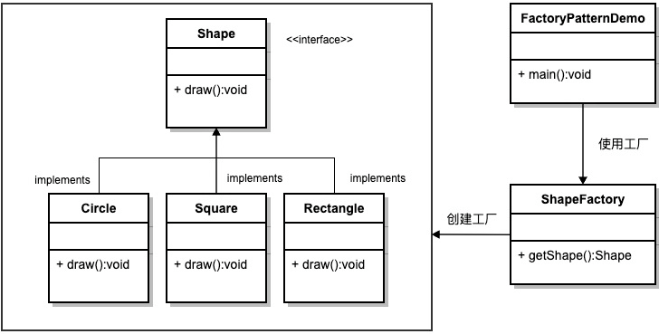

## 什么是ioc和di

**ioc即控制反转**，在不使用ioc之前，我们如果创建对象需要new一个出来，这样会产生很强的依赖关系，耦合度很高

使用ioc之后，我们只需要描述我们需要什么，告诉工厂去给我们资源。这样的话，降低了程序之间的耦合度和复杂度，更加灵活

**di即依赖注入**，通过读取配置文件，将所需要的对象和对应的变量产生映射或者说组件已事先定义好的方式，获取容器的资源注入

## 注入方式有哪些

setter注入，构造器注入，注解注入

## 什么是aop

aop即面向切面编程，个人理解就是一个增强版的动态代理。

在以前，开一发个业务逻辑，我们关注的不知有核心业务，还有非核心业务，比如说是否登录，权限，日志记录等，当然我们也可以将这些方法写成一个公用方法，但是依然很繁琐。aop出现之后，我们开始面向切面编程，即只需要关注核心业务，非核心业务无需关注，只需要配置好相应的文件即可。

aop中概念：

连接点：程序运行中一个点

切面：切点和切面的组合

切点：选择要进行方法增强的点

通知/adivce：具体增强所需要实现的内容

## BeanFactory和ApplicationContext的区别

beanfactory是spring的顶层接口，在getbean的时候初始化对象。

ApplicationContext是beanfactory的扩展，在读取配置文件时创建对象。

## bean的作用域

**singleton**：ioc容器中只会存在一个bean对象，每次使用也是该对象，无状态使用单例模式

**prototype**：每次对该bean对象请求都会创建一个bean对象，一般用于有状态的bean都是用这个

**request**：每一次http请求都会创建一个bean对象，仅仅在web的spring application context情形下有效

session：在一个http session中，一个 bean 对应一个实例

globalsession：在一个全局http session 中，一个bean 对应一个实例

## bean的生命周期

bean的定义，初始化，调用，销毁

init-method，destory-method完成初始化和销毁

## 将对象注册到spring容器中去的注解有哪些

@Component()、@Service()、@Controller()、@Respository()。

对应组件，服务层，控制层，dao层

## 注解

指定对象作用范围：@scope

值的注入：@Value()

## autowired和recourse的区别

autowired首先通过类型注入，如果找不到，再通过名称注入

recourse首先通过名称注入，如果找不到，通过类型注入

**Qualifier** 如果在一个类当中含有多个相同类型或者名称的变量，可以指定名称进行注入

## 切面通知类型

before：在方法之前

after：在完成调用之后

around：在增强方法之前和之后都可以

after-returning：在方法成功调用之后

after-throwing：在方法发生异常之后

## 传播

即在service层同级调用时，产生的事务相关的问题

传播行为：

REQUIRED：有加入，无创建

REQUIRES_NEW:	有加入，无挂起等待事务

supports：有加入，无事务

NOT_SUPPORTED：有事务，等待完成，非事务

MANDATORY：强制事务，没有抛异常

NESTED：嵌套使用

NEVER：非事务

## spring的设计模式

### 简单工厂模式

根据传入的参数，返回对应的对象，通常返回的实例具有相同的父类

三部分组成：抽象产品类，具体产品类，工厂类

优点：
	1.无需知道工厂内部的具体实现，只需要知道对应的参数
	2.通过引入配置文件，可以在不修改代码的情况下更换和增加产品类，提高了系统的灵活性。

缺点：

​	1.工厂内部集成了所有产品的创建逻辑，一旦不能工作，将会影响整个系统
​	2.系统扩展困难，如果添加新的产品，将不得不修改工厂逻辑，同时也破坏了开闭原则，不利于系统维护。

### 单例设计模式
在整个软件系统运行过程中，这个类只被实例一次,以后不论在哪都只调用这一 个实例
关键：将**构造方法私有化**

1. 饿汉式：编译后立即创建对象
2. 懒汉式：等到第一个人使用时在创建对象，以后调用的都是这一个对象，线程不安全
3. 双重加锁：两次判断实例是否存在，确保了多线程安全，提高了运行效率

原因：

1. 创建对象时耗时太长，比如人脸识别
2. 创建多个对象没有必要

### 模板设计模式

抽象类作为多个子类的通用模板，子类在抽象类的基础上进行扩展、改造，但子类总体上会保留抽象的行为方式。
解决的问题:
 	1.当功能内部一部分实现是确定，一部分实现是不确定的。这时可以把不确
定的部分暴露出去，让子类去实现。
	2.编写一个抽象父类，父类提供了多个子类的通用方法，并把一个或多个方
法留给其子类实现，就是一种模板模式。

### 工厂方法

工厂模式是简单工厂模式的进一步抽象，创建一个 *Shape* 接口和实现 *Shape* 接口的实体类。下一步是定义工厂类 *ShapeFactory*。

*FactoryPatternDemo* 类使用 *ShapeFactory* 来获取 *Shape* 对象

优点：

- 解耦，只需要知道具体名称就可以得到相应产品，无需知道创建过程
- 灵活性增加，增加类只需要添加相应的工厂类

缺点：

- 增加了系统的抽象性和理解难度
- 抽象产品只能生产一种产品
- 随着类的增加，增加了复杂度

模式设计

### 适配器模式