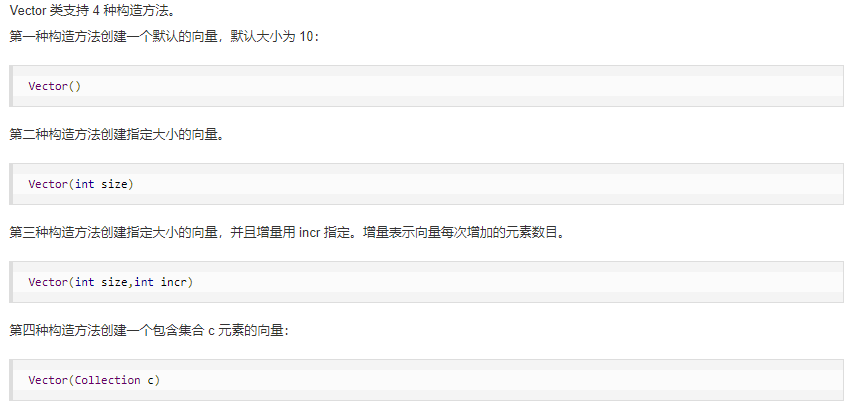

# Java面试

## JAVA

. JRD (Java Runtime Dnvironment):是Java程序的运行时环境，包含JVM和运行时所需要的核心类库。
. JDK (Java Developmeil Kit): 是Java程序开发工具包，包含JRD和开发人员使用的工具。

### 基础知识：

关键字（保留字）

标识符（变量，常量）

#### 数据类型转换

**自动转换**（数据范围由小转大）

**强制转换**（数据范围由大转小）eg：int a = (int)12.5

byte/short/char 在进行运算时会先转换为int类型然后再运算

jshell（cmd开启后，写一句执行一句，脚本语言，类似python，php）

### 数组

```java
	int[] arrA = new int[100];//动态初始化
	int[] arrB = new int[]{10,20,30};//静态初始化
	int[] arrC = {1,2,23};//省略格式
```

面向对象基本特征：**封装，继承，多态**

## 局部变量和成员变量 区别

1.定义的位置不一样[重点]
    局部变量:在方法的内部
    成员变量:在方法的外部，直接写在类当中
2.作用范围不一样[重点]
    局部变量:只有方法当中才可以使用，出了方法就不能再用
    成员变量:整个类全都可以通用。
3.默认值不一样[重点]
    局部变量:没有默认值，如果要想使用，必须手动进行赋值
    成员变量:如果没有赋值，会有默认值，规则和数组- -样
4.内存的位置不一样(了解)
    局部变量:位于栈内存
    成员变量:位于堆内存
5.生命周期不一样(了解)
    局部变量:随着方法进栈而诞生，随着方法出栈而消失
    成员变量:随源对象创建而诞生，随着对象被垃圾回收而消失

## 封装性

方法，privite都可进行封装。

将细节信息进行封装，对外界不可见。

## 继承性 extends

解决**共性抽取**

java**单继承**（不可同时继承多个父类），**多级继承**（可以按顺序继承父类）

protected 用于修饰成员，表示在继承体系中成员对于子类可见

## 多态性

**同一个行为**具有多个**不同表现形式或形态**的能力

用法：fu obj = new zi();

1.直接通过对象名称访问成员变量，看等号左边是谁，优先用谁，没有则向上找。
2.间接通过成员方法访问成员变量，看该方法属于谁，优先用谁，没有则向上找。


### 当父类子类都有同名变量或方法时

1.直接通过子类对象访问成员变量:
		等号左边是谁， 就优先用谁，没有则向上找。
2.间接通过成员方法访问成员变量:
		该方法属于谁，就优先用谁，没有则向上找。

### 变量/方法访问

局部变量:直接写成员变量名
本类的成员变量/方法:this.成员变量名
父类的成员变量/方法: super. 成员变量名
内部类访问外部成员变量/方法：外部类名称.this.外部类成员变量名

### 重写与重载

重载：多个方法名称相同，参数个数，类型	，多类型顺序不同且和修饰符无关：public，static等

重写：父类与子类之间的多态性，对父类的函数进行重新定义。

## String

字符串是常量:它们的值在创建之后不能更改。底层是使用byte字节数组存储。

```
可以使用三种类型 构造 字符串
//使用空参构造
String str1 = new String(); //小括号留空,说明字符串什么内容都没有。
System.out.println("第1个字符串: " + str1);
//根据字符数组创建字符串
char[] charArray = { 'A', 'B',‘C' };
String str2 = new String(charArray);
System.out.println("第2个字符串:”+ str2);
//根据字节数组创建字符串
byte[] byteArray ={ 97, 98, 99 };
String str3 = new String(byteArray);，
System.out.println("第3个字符串:”+ str3);
直接创建字符串
String str4 = "abc";
```

注：

1.对于引用类型来说，= =进行的是地址值的比较。而基本类型是比较值是否相等。
2.双引号直接写的字符串在常量池（堆）当中，new的不在池当中。
3.字符串比较使用equals
4.字符串分割split
5.字符串替换replace
6.字符串裁剪substring
7.字符串连接concat

## static

修饰变量：这个变量不再属于对象自己，而是属于所在的类。多个对象共享同一份数据。

修饰方法：变为静态方法。普通成员方法需要一个对象才能使用，而静态方法则可直接通过类名称调用。

注：

1.静态不能访问非静态（先初始化静态，后初始化非静态）

2.静态方法不能使用this，this表示的是当前对象。


**静态代码块用途**：（首次使用类时，只会执行一次）对静态成员变量进行赋初值。

## super关键字

​	1.在子类的成员方法中，访问父类的成员变量。
​	2.在子类的成员方法中，访问父类的成员方法。
​	3.在子类的构造方法中，访问父类的构造方法。

##  this关键字
	1.在本类的成员方法中，访问本类的成员变量。
	2.在本类的成员方法中，访间本类的另一个成员方法。
	3.在本类的构造方法中，访问本类的另一个构遣方法。
在第三种用法当中要注意:
    A. this...调用也必须是构造方法的第一个语句，唯一一 个。
    B. super和this两种构造调用，不能同时使用。
	super关键字用来访问父类内容，而this关键字用来访问本类内容

## 接口/抽象

抽象可以使一个类中某个方法交给子类实现

接口：类中定义好方法和变量，由子类实现。

java 8 新特性：

接口默认方法（default）：在已经有子类的情况下修改父类，添加default关键字的方法后，其子类无需实现方法内容，尽最大可能不去修改代码。

接口静态方法（static）：静态接口直接调用静态方法。

java 9新特性：允许接口中含私有方法（普通，静态）

 抽象类是用来捕捉子类的通用特性的，而接口则是抽象方法的集合；抽象类不能被实例化，只能被用作子类的超类，是被用来创建继承层级里子类的模板，而接口只是一种形式，接口自身不能做任何事情。 其次，抽象类可以有默认的方法实现，子类使用extends关键字来继承抽象类，如果子类不是抽象类的话，它需要提供抽象类中所有声明方法的实现。而接口完全是抽象的，它根本不存在方法的实现，子类使用关键字implements来实现接口，它需要提供接口中所有声明方法的实现。 抽象类可以有构造器，除了不能实例化抽象类之外，它和普通Java类没有任何区别，抽象方法可以有public、protected和default这些修饰符。而接口不能有构造器，是完全不同的类型，接口方法默认修饰符是public，不可以使用其它修饰符。	

## 转型

**向上转型：父类 对象名 = new 子类（）；**

- 向上转型都是安全的

- 右侧创建一个子类对象，把它当做父类来看待使用。

- 从小范围转向了大范围。

**向下转型：子类名称对象名= (子类名称)父类对象;**

- 对象的向下转型，其实是一个[还原]的动作。
- 含义:将父类对象，[还原] 成为本来的子类对象。
  Animal animal = new Cat0; //本来是猫，向上转型成为动物
  Cat cat = (Cat) animal; //本来是猫，已经被当做动物了,还原回来成为本来的猫
- 注意事项
  a.必须保证对象本来创建的时候，就是猫，才能向下转型成为猫。
  b.如果对象创建的时候本来不是猫，现在非要向下转型成为猫，就会报错。

### instanceof

向下转型时，进行判断：**对象名 instanceof 类**

使用场景：当一个方法传入的参数不确定时（即传入子类类型不确定）

## 内部类

**成员内部类**：一个类中还有一个类（body-heart）

使用方式:
1.间接方式:在外部类的方法当中，使用内部类;然后main只是调用外部类的方法。
2.直接方式，公式:【外部类名称.内部类名称对象名= new外部类名称(). new内部类名称();】

**局部内部类**：在一个方法中的类（不能被权限修饰符修饰直接 	class 类名称{}）

通过方法对类进行调用

### 局部内部类中匿名内部类

```
接口名称 对象名 = new 接口名称（）{
	//重写的抽象方法
}；
对象名.方法（）;
```

如果接口的实现类(或者是父类的子类)只需要使用唯一的一次，
那么这种情况下就可以省略掉该类的定义，而改为使用[匿名内部类]。


## 反射

### 反射原理

是在运行状态中，对于任意一个类，都能够知道这个类的所有属性和方法；对于任意一个对象，都能够调用它的任意一个方法和属性；这种动态获取的信息以及动态调用对象的方法的功能称为 Java 语言的反射机制。

```
通过反射获取对象
class a = class.forname（）原生jdbc方法，优点编译时无需判断包是否存在，缺点包丢失
class a = 类.class（）效率高
class a = 对象.getClass（）

a.newInstance()//创建对象


通过反射获取构造方法
getConstructors (class...)//获取公有构造方法
getDeclaredConstructors (class...)//获取全部构造方法
getName();//获取方法名称
getModifiers();//获取修饰符
getParameterTypes () ;//获取参数类型

c.setrccessible(true);//解除私有的封装，强制调用私有方法

通过反射获取方法
getDeclaredMethods(方法名，class...)//表示的类或接口的全部方法
getMethods(方法名，class...)//获取公有方法
getModifiers()//获取修饰符
getName();//获取方法名称


通过反射获取属性
getFields()//公开属性
getDeclaredFields()//全部属性
getName();//获取属性名称
getModifiers()//获取修饰符

通过反射调用方法
obj先通过反射，构造器创建一个对象
.invoke（obj，参数列表）
```

反射优点：动态创建对象较灵活，

缺点：是jvm主动加载的过程，所引用的包必须在无安全限制的情况下使用，性能开销较大。

## 类加载

### 编译流程

Java开发：编写，编译，运行


java文件通过编译器变成了.class文件，接下来类加载器又将这些.class文件加载到JVM中

### 类加载过程


**类加载的过程包括了加载、验证、准备、解析、初始化五个阶段**

- 加载是”类加机制”的第一个过程，**在加载阶段，**虚拟机主要完成三件事：

  （1）通过一个类的全限定名来获取其定义的二进制字节流

  （2）将这个字节流所代表的的静态存储结构转化为方法区的运行时数据结构

  （3）在堆中生成一个代表这个类的Class对象，作为方法区中这些数据的访问入口。

- **验证的主要作用就是确保被加载的类的正确性。**

- **准备阶段主要为类变量分配内存并设置初始值**

  - 类变量（static）会分配内存，而实例变量不会
  - 初始值指的是数据类型默认值，而不是代码中被显示赋予的值。public static int value = 1; //在这里准备阶段过后的value值为0，而不是1。赋值为1的动作在初始化阶段

- **解析阶段主要是虚拟机将常量池中的符号引用转化为直接引用的过程**

  - 符号引用：以一组符号来描述所引用的目标（变量）
  - 直接引用：直接引用是可以指目标的指针、相对偏移量或者是一个能直接或间接定位到目标的句柄。

- **初始化**：JVM负责对类进行初始化，主要对类变量进行初始化

### 动态代理

在执行一些方法之前需要执行一些方法

步骤：

1. 创建一个接口，一个子类继承接口
2. 创建一个代理类实现invocationHandler
3. 在代理类中创建obj对象，实现invoke方法
4. 在其他地方创建代理对象（Proxy.newInstance(handler.getClass.getClassLoader(), 接口，handler)），进行调用方法

## 线程

实现方式：

实现callable，有返回值，FutureTask接受返回值，实现runable，继承Thread方法

**实现接口 VS 继承 Thread**
实现接口会更好一些，因为：
Java 不支持多重继承，因此继承了 Thread 类就无法继承其它类，但是可以实现多个接口；
类可能只要求可执行就行，继承整个 Thread 类开销过大。

## 进程调度算法

操作系统中的进程调度算法
批处理系统：用户无需过多操作，主要保证吞吐量和时间

- 先来先服务：根据作业的先后顺序进行调度，利于长作业，不利于短作业
- 短时间优先：根据作业的运行时间进行调度，优先执行短作业任务，不利于长作业
- 最优剩余时间：当新作业到达时，会比较新作业和当前进程的运行时间，如果新作业运行时间短，就会挂起当前进程，执行新作业。

交互式系统：需要处理用户的大量交互操作
- 时间片轮转：将就绪状态的进程排成一个队列，每次调度将cpu时间分配给队首，当时间片用完之后，将队首进程插入到队尾。同时将cpu时间分给队首。
- 优先级调度：为每一个进程安排一个优先级，随着等待时间越长，优先级逐渐变高
- 多级反馈队列：一个进程如果要执行100次时间片，那就需要交换100次，而多级反馈队列就是为了解决这个问题，多级反馈队列有多个队列，每个队列的时间片和优先级据不同，越靠前队列优先级越高，只有当之前的队列都执行完之后，才会执行后面的队列。

## 进程同步

临界区:对临界资源进行访问的那段代码,每次访问需要先进行检查

同步:多个进程按照一定顺序执行

互斥:同一时间只有一个进程可见访问临界区


## 锁

### synchronized

1.同步一个代码块
2.同步一个方法
3.同步一个类
4.同步一个静态方法

### ReentrantLock

synchronized关键字。不需要用户手动释放锁。reenterantlock:手动释放锁。(如果没有释放， 可能出现死锁)lock () ，unlock(), try finally

synchronized不能中断的。抛出异常可以中断。代码正常运行结束可以中断可以中断的。设置超时方法trylock (timeout. timeunit)
lockinterruptibly ()。 调用interrupt ()可以中断

synchronized。非公平reenterantlock。两个都可以。默认是非公平。如果想改成公平锁。在构造方法里面。传入true, 公平锁。false 非公平锁

**公平锁**是指多个线程在等待同一个锁时，必须按照申请锁的时间顺序来依次获得锁。

第一个是 JVM 实现的 synchronized，而另一个是JDK 实现的 ReentrantLock。

## 锁机制

### 悲观锁：先上锁，在访问

对数据库数据进行修改时，持悲观态度，每次读取数据时，默认其他线程会修改数据，所以需要加锁

数据库：行锁，表锁，读锁，写锁

Java：synchronized实现

读锁：多个事务对于同一数据可以共享一把锁，都能访问到数据，但是不能修改

写锁：不能和其他锁共存，如果一个事务获取到了写锁，那么其他事务不能再获取改行的其他锁

### 乐观锁

假设一般情况下数据操作不会造成冲突，只有在数据提交更新的时候对数据进行检测判断是否冲突，如果发现冲突，让用户决定如何处理。乐观锁适用于读操作较多的场景，可以提高吞吐量。

实现：版本号控制，数据每修改一次，版本号加一，当要修改数据时，比对版本号，只有版本号一致时，才更新数据，否则重试更新操作，直至完成。

### 死锁

多个进程同时对一个资源进行争夺而造成的一种僵局，若无外力打破这种局面，将无法向前推进。

比如说：线程A，B需要获取两个c,d资源，线程A先获取了c，在获取d，线程B先获取了d，在获取c，由于线程ab获取资源的顺序不一样，此时两个线程都在等待资源的释放，就变成了死锁。

### 处理死锁

#### 预防死锁

- 一次性获取所有的资源
- 如果有一个资源没有被分配到，则不给该进程再分配资源
- 线程获得了部分资源，但是得不到其他资源，那么释放已经得到的资源
- 将系统资源赋予编号，每个进程按照资源编号递增的顺序请求资源。

#### 处理死锁

由于处理死锁的带教比较高,为了获取更高的性能,就假装没有发生

### 银行家算法


## cookies和session的区别

什么是cookies，和session的区别
由于http请求时无状态的，所以为了解决这一问题，引入了cookies，cookies是客户端访问服务器后，服务器返回的一小块信息，在这之后，我们每一次访问该服务器，请求都会带上cookies
cookies可以用于用户登陆状态，存储购物车信息，还可以用于保存设置相关信息，主题等，还可以用于分析用户的操作信息
cookies是不能删除和修改的，只能起一个相同的名字进行覆盖操作，如果想要销毁一个cookies，只需要设置maxage为0，maxage为-1表示只能在当前页面使用
而session是存储在服务器端的，当第一次访问服务器时就会创建相应的session，每一次访问都会携带session id判断相应的用户数据标志
使用session更加安全，当然，同时也会增加服务器的压力，而session的过期时间是由服务器设定的

## sql优化

- 尽量避免全局扫描表
- 尽量不使用判空操作，!=   判断，or 关键字会导致全表扫描，or可以换成采用union分别查询
- 经常使用的where和order by 字段可以建立索引
- 如果where 的条件中有运算，尽量先将运算结果存起来在调用
- 尽量避免一次性返回大量数据，可以使用分页返回

##  JVM

Java的内存需要划分成为5个部分:
1.**栈(Stack)** :存放的都是**方法中的局部变量**。**方法的运行一定要在栈当中**。
局部变量:方法的参数，或者是方法{}内部的变量
作用域: -旦超出作用域，立刻从栈内存当中消失。
2.**堆(Heap)** :**凡是new出来的东西，都在堆当中。**
		堆内存里面的东西都有一个地址值: 16进制	
		堆内存里面的数据，都有默认值。规则:
				如果是整数		 			 默认为0
				如果是浮点数		 		 默认为0.0
				如果是字符  					默认为‘\u0000’
				如果是布尔			  		默认为false
				如果是引用类型  			默认为null
3.**方法区(Method Area)** :存储**.class相关信息**，包含**方法的信息**。
4.**本地方法栈(Native Method Stack)** :与操作系统相关。 
5.**寄存器(pc Register)** :与CPU相关。

- jvm初探：[Java语言入门到精通84-87](https://www.bilibili.com/video/BV1Qy4y1k7kL?p=84)	
- 对象调用内存分析：[Java语言入门到精通102-106](https://www.bilibili.com/video/BV1Qy4y1k7kL?p=102)
- 当一个对象作为参数，传递到方法当中时,实际上传递进去的是对象的地址值。

### 堆栈

- 堆内存是是Java内存中的一种，它的作用是用于存储Java中的对象和数组，**先进先出，后进后出**，堆可以动态地分配内存大小，生存期也不必事先告诉编译器，因为它是在运行时动态分配内存的。
- 栈内存是Java的另一种内存，主要是用来执行程序用的，比如：基本类型的变量和对象的引用变量，**先进后出，后进先出**

### 垃圾回收

引用：

1. **强引用**就是指在程序代码之中普遍存在的，类似"Object obj=new Object()"这类的引用，垃圾收集器永远不会回收存活的强引用对象。
2. **软引用**：还有用但并非必需的对象。在系统 **将要发生内存溢出异常之前** ，将会把这些对象列进回收范围之中进行第二次回收。
3. **弱引用**也是用来描述非必需对象的，被弱引用关联的对象 **只能生存到下一次垃圾收集发生之前** 。当垃圾收集器工作时，无论内存是否足够，都会回收掉只被弱引用关联的对象。
4. **虚引用**是最弱的一种引用关系。 **无法通过虚引用来取得一个对象实例** 。为一个对象设置虚引用关联的唯一目的就是能在这个对象被收集器**回收时收到一个系统通知**。
```java
public class FinalizerTest {
    public static FinalizerTest object;
    public void isAlive() {
        System.out.println("I'm alive");
    }
 
    @Override
    protected void finalize() throws Throwable {
        super.finalize();
        System.out.println("method finalize is running");
        object = this;
    }
 
    public static void main(String[] args) throws Dxception {
        object = new FinalizerTest();
        // 第一次执行，finalize方法会自救
        object = null;
        System.gc();
 
        Thread.sleep(500);
        if (object != null) {
            object.isAlive();
        } else {
            System.out.println("I'm dead");
        }
 
        // 第二次执行，finalize方法已经执行过
        object = null;
        System.gc();
 
        Thread.sleep(500);
        if (object != null) {
            object.isAlive();
        } else {
            System.out.println("I'm dead");
        }
    }
}
```

```
method finalize is running
I'm alive
I'm dead
```

第一次发生 GC 时，`finalize()` 方法的确执行了，并且在被回收之前成功逃脱；
第二次发生 GC 时，由于 `finalize()` 方法只会被 JVM 调用一次，object 被回收。

**无用类**

a. 该类所有的实例都已经被回收，也就是 Java 堆中不存在该类的任何实例。

b. 加载该类的 ClassLoader 已经被回收。

c. 该类对应的 java.lang.Class 对象没有在任何地方被引用，无法在任何地方通过反射访问该类的方法。


## 顺序访问数据和随机访问数据

 顺序访问意味着从第一个元素开始逐个地读取元素。链表只 能顺序访问：要读取链表的第十个元素，得先读取前九个元素，并沿链接找到第十个元素。

 随机 访问意味着可直接跳到第十个元素。经常说数组的读取速度更快，这是因为它们支持随机访 问。很多情况都要求能够随机访问，因此数组用得很多。数组和链表还被用来实现其他数据结构。

 所以说当写入操作多读取操作少时选择链表存储，写入操作少读取操作多时选择数组存储，链表擅长插入和删除，而数组擅长 随机访问

- 顺序访问的数据是连续的。硬盘的磁头是按一定的顺序访问磁片，磁头不做频繁的寻道，这样带来的结果是速度很快。因为寻道时间是影响磁盘读写速度的主要原因。在平常的应用中顺序访问的应用很少。大文件的连续备份，是顺序读写的。dd就是典型的顺序读写，
- 随机访问主要是磁头在做频繁的移动，原因是数据在磁盘的不连续性，这和数据存放到磁盘的过程有关系，随机访问的速度要比顺序访问慢很多。原因也是因为磁头频繁的寻道，定位，磁头的移动消耗掉很多时间。大部分的应用在磁盘上的读写是随机的。

## 容器

### set：无序、不可重复的集合

**HashSet**是Set接口的典型实现，大多数时候使用 Set集合时都使用这个实现类。我们大多数时候说的set集合指的都是HashSet
HashSet按**Hash算法**来存储集合中的元素，因此具有很好的**存取和查找**性能。
HashSet具有以下特点:
    **不能**保证元素的排列顺序
    **不可重复**
    **HashSet不是线程安全的**
    集合元素可以使null
当向HashSet集合中存入一个元素时，HashSet 会调用该对象的hashCode()方法来得到该对象的hashCode值,然后根据hashCode值决定该对象在HashSet中的存储位置。
如果两个元素的equals()方法返回true,但它们的hashCode()返回值不相等,
hashSet将会把它们存储在不同的位置，但依然可以添加成功。


**TreeSet（有序，不可重复集合）** 会调用集合元素的compareTo(Object obj)方法来比较元素之间的大小关系，然后将集合元素按升序排列

定制排序需要实现comparator接口实现


### list：有序,可重复的集合

Arraylist集合：ArrayList是一个可变数组，默认大小为10，每一次扩容通过grow方法，每次扩容都是之前的1.5倍，扩容后将之前旧的数据拷贝到新的数组当中，丢弃原来数组。支持随机访问，读取效率高，增加删除效率低且线程不安全

注：Arraylist<e>其中e只能用引用类，不能用基本类，e存的是地址，基本类没有地址

常见方法

```
public boolean add(D e). 向集合当中添加元素，参数的类型和泛型一致....
public Boolean set(D D) 修改元素
public D get(int index). 从集合当中获取元素，参数是索引编号，返回值就是对应位置的元素。。
public D remove(int. index) 从集合当中删除元素，参数是索引编号，返回值就是被册除掉的元素。
public int size(); 获取集合的尺寸长度，返回值是集合中包含的元素个数。
```


LinkedList是一个双链表，在添加和删除元素时具有比ArrayList更好的性能。但在get与set方面弱于ArrayList。线程不安全

Vector：线程安全




### map：具有映射关系的集合

**HashMap：**

- HashMap是基于哈希表实现的，每一个元素是一个key-value对，其内部通过单链表解决冲突问题，容量不足（超过了阀值）时，同样会自动增长。

- HashMap是非线程安全的，只是用于单线程环境下，多线程环境下可以采用concurrent并发包下的concurrentHashMap。

- HashMap 实现了Serializable接口，因此它支持序列化，实现了Cloneable接口，能被克隆。

HashMap内部维护了一个存储数据的Dntry数组，HashMap采用链表解决冲突，每一个Dntry本质上是一个单向链表。过hash(key)方法计算hash值，然后通过indexFor(hash,length)求该key-value对的存储位置。

**HashTable：**

-    Hashtable同样是基于哈希表实现的，同样每个元素是一个key-value对，其内部也是通过单链表解决冲突问题，容量不足（超过了阀值）时，同样会自动增长。
-    Hashtable也是JDK1.0引入的类，是线程安全的，能用于多线程环境中。
-    Hashtable同样实现了Serializable接口，它支持序列化，实现了Cloneable接口，能被克隆。

**不同：**

- Hashtable继承自Dictionary类，而HashMap继承自AbstractMap类。但二者都实现了Map接口。
- javadoc中关于hashmap的一段描述如下：此实现不是同步的。如果多个线程同时访问一个哈希映射，而其中至少一个线程从结构上修改了该映射，则它必须保持外部同步。
- 在HashMap中不能由get()方法来判断HashMap中是否存在某个键， 而应该用containsKey()方法来判断。
- 哈希值的使用不同，HashTable直接使用对象的hashCode，而HashMap重新计算hash值。
- HashTable在不指定容量的情况下的默认容量为11，而HashMap为16，Hashtable不要求底层数组的容量一定要为2的整数次幂，而HashMap则要求一定为2的整数次幂。Hashtable扩容时，将容量变为原来的2倍加1，而HashMap扩容时，将容量变为原来的2倍。


一、java 基础

1.1 请你说明 String 和 StringBuffer 的区别

string一旦创建后便不可修改，每次修改实际上都会在堆中创建新的对象，栈中的变量指向了新创建的对象后，原来的对象就会被垃圾回收。

Stringbuffer创建的对象是一个可修改的对象，每次修改并不会在创建一个新的对象，而是通过append方法添加到字符序列中，底层使用的是char数组。

StringBuilder和StringBuffer除了线程安全以外没有其他不同。

​	

1.2 请你说明一下 int 和 Integer 有什么区别

int 是基本数据类型，Interger是引用数据类型。他们内存中的位置也不相同，基本数据类型存储的位置是在栈中，赋值，运算速度较快，而引用数据类型存储的位置在堆中，


1.3 数组(Array)和列表(ArrayList)的区别？什么时候应该使用 Array 而不是 ArrayList？

Array是一个固定数组，无法扩容，ArrayList是一个可变数组，默认大小为10，每一次扩容通过grow方法，每次扩容都是之前的1.5倍，扩容后将之前旧的数据拷贝到新的数组当中，丢弃原来数组。支持随机访问，读取效率高，增加删除效率低且线程不安全


1.4 什么是值传递和引用传递？

值转递，指的是方法调用时，复制一份实际参数（基本类型的值 或者 引用对象）到方法参数中。这样在方法中参数变更了，不影响实际参数。 引用传递，指方法调用时，直接将实际参数传递到方法参数中，对方法参数的变更，会影响实际参数。


1.5Java 支持的数据类型有哪些？什么是自动拆装箱？

基本数据类型有int，double，float，char，byte，boolean，short，long

装箱：基本数据类型转化为包装类。

拆箱：包装类转化为基本数据类型。

int的自动装箱都是通过`Integer.valueOf()`方法来实现的，Integer的自动拆箱都是通过`integer.intValue`来实现的。

自动拆装箱就是数据类型自动转换


**1.6 为什么会出现 4.0-3.6=0.40000001 这种现象？**

**浮点数值采用二进制系统表示， 而在二进制系统中无法精确地表示分数 1/10。**


**1.7java8 的新特性吗，请简单介绍一下**

lamada表达式

接口的默认方法，私有方法


1.8 你说明符号“==”比较的是什么？

对于基本类型，== 判断两个值是否相等，基本类型没有 equals() 方法。
对于引用类型，== 判断两个变量是否引用同一个对象，而 equals() 判断引用的对象是否等价。


**1.9Object 若不重写 hashCode()的话，hashCode()如何计算出来的？**

Object 的 hashcode 方法是本地方法，也就是用 c 语言或 c++ 实现的，该方法直接返回对象的 内存地址。


**1.10 为什么重写 equals 还要重写 hashcode？**

hashcode是用于散列数据的快速存取，如果我们对一个对象重写了euqals，意思是只要对象的成员变量值都相等那么euqals就等于true，但不重写hashcode，那么我们再new一个新的对象，当原对象.equals（新对象）等于true时，两者的hashcode却是不一样的，由此将产生了理解的不一致，如在存储散列集合时（如Set类），将会存储了两个值一样的对象，导致混淆


**1.11 若对一个类不重写它的 equals()方法是如何比较的？**

不重写equals方法其比较的是对象的地址


二、关键字

2.1Java 里面的 final 关键字是怎么用的？

修饰类：表明这个类不能被继承。也就是说，如果一个类你永远不会让他被继承，就可以用final进行修饰

修饰方法：final修饰的方法表示此方法已经是“最后的、最终的”含义，亦即此方法不能被重写（可以重载多个final修饰的方法）

修饰变量：当final修饰一个基本数据类型时，表示该基本数据类型的值一旦在**初始化后便不能发生变化**；如果final修饰一个引用类型时，则在对其初始化之后便不能再让其指向其他对象了，但该引用所指向的对象的内容是可以发生变化的


2.2 谈谈关于 Synchronized 和 lock


2.3 请你介绍一下 volatile？


2.4 请你介绍一下 Syncronized 锁，如果用这个关键字修饰一个静态方法，锁住了什么？如果修饰成员方法，锁住了什么？

syncronized 是非公平锁，不需要手动释放锁，基于jvm实现，效率较高，


三.面向对象

3.1Java 中的方法覆盖(Overriding)和方法重载(Overloading)是什么意思？

override指的是父类方法的重写，父类的某个方法不适合当前的业务流程，那就需要对父类的方法进行重写

overload指的是方法的重载，也就是相同的函数名称，但是参数不同。


3.2 如何通过反射获取和设置对象私有字段的值？


3.3 请说明内部类可以引用他包含类的成员吗，如果可以，有没有什么限制吗？


3.4 当一个对象被当作参数传递给一个方法后，此方法可改变这个对象的属性，并可返回变化后的结果，那么这里到底是值传递还是引用传递?


3.5 什么是泛型？

**泛型就是类型参数化，处理的数据类型不是固定的，而是可以作为参数传入。**

泛型的好处就是降低了程序的耦合度，提高了代码复用，保证类型安全

```
class  myList<T>{
	private T t;	
} //泛型类
interface myinterface<T>{
	test(T t);
}//泛型接口
public <T> void test(T t){
	 
}//泛型方法
```


3.7”static”关键字是什么意思？Java 中是否可以覆盖(override)一个 private 或者是 static 的方法？

static指的是静态，被static修饰的方法和变量存储在方法区中的静态区，含有static修饰的接口和类可以直接通过接口名称或者类名称直接调用静态方法。

不可以覆盖private和static

private：在继承了一个父类后，其子类无法看见父类的私有方法。

static：override是动态绑定的，也就是先创建一个父类，在创建一个子类，static是静态编译绑定的。


3.9 类和对象的区别

1.存储：类是存储在方法区的，而对象存储的位置在堆中

2.类它是一类对象的抽象，包含了许多对象的共性，定义了一写属性和方法，而对象它是类的实例，一个实体，通过属性的不同值来区分。


