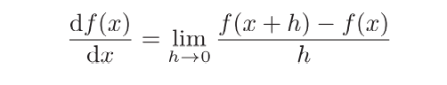
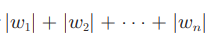
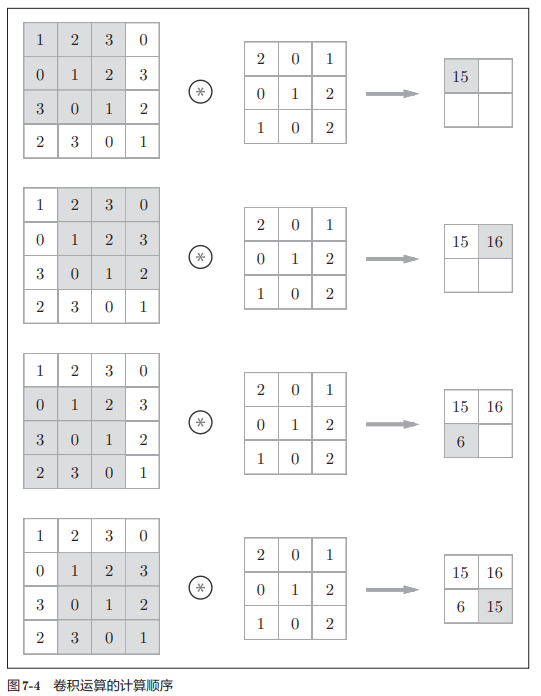
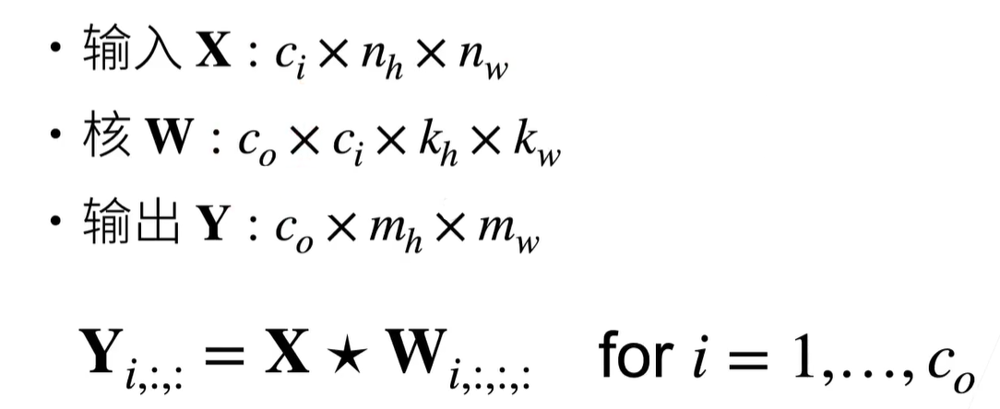

# 深度学习

> 神经网络大致结构：卷积层，池化层，affine(dot,sigmoid) ，softmax，loss

## 激活函数

> 众所周知，用作激活函数的函数最好具有关于原点对称的性质。tanh函数是关于原点(0, 0)对称的S型曲曲线。

### tanh函数


```python
def tanh(x):
    a = 1 - np.exp(-2*x)
    b = 1 + np.exp(-2*x)
    return a/b
```

### Sigmoid函数

> 连续，sigmoid函数是关于(x, y)=(0, 0.5)对称的S型曲曲线


```python
import numpy as np
def sigmoid(x):
    return 1/1+np.exp(-x)
```


### 阶跃函数

> 非连续

```python
def step(x):
	if x > 0:
        return 1
    else: 
    	return 0
```


### ReLU函数

> 修正函数,常用，计算量相较于exp来说较小


```python
def ReLu(x):
    if x > 0:
        return x
    else:
        return 0
```


## 输出层函数

### 恒等函数

> 原样输出，不做改变

```python
def	equal(x):
    return x
```

### Softmax函数

> 常见于**分类问题**
>
> 多元分类softmax(由于softmax特性，即softmax的所有输出结果相加为1)


```python
def softmax(x):
    c = np.max(x)
    exp_x = np.exp(x - c)# 防止溢出
    return exp_a / np.sum(exp_x)
```

### log_softmax函数

> **log_softmax能够解决函数overflow和underflow，加快运算速度，提高数据稳定性**


## 损失函数

### 均方误差

> 均方根差 = sqrt(均方误差)
>
> RMSE = sqrt(MSE)


```python
def mse(y,t):
    return 0.5 * np.sum((y-t)**2)
```

### 交叉熵误差

> 常用,在pytorch中，将softmax，log，nll loss合并为一步，one-hot表示


```python
def Cee(y,t):
    delta = 1e-7
	return - np.sum(t * np.log(y + delta))
```

#### Mini-batch 交叉熵


```python
def mini_batch_Cee(y,t):
    delta = 1e-7
    if y.dim == 1:
        t = t.reshape(1,t.size)
        y = y.reshape(1,y.size)
    batch_size = y.shape[0]
    return - np.sum(t * np.log(y + delta)) / batch_size
```

### nll loss

> Log_softmax->nll_loss

## 数值微分

> 需掌握基础知识
>
> 导数(存在误差)



> 数值微分(推荐使用)


```python
def	numercial_diff(f,x):
    h = 1e-4
    return (f(x+h) - f(x-h))/(2 * h)
```

### 梯度(数值微分实现,耗时)

> 全部**变量的偏导数**汇总而成的向量

```python
def numerial_gradient(f,x):
    h = 1e-4
    grad = np.zeros_like(x)
    for i in range(x.size):
        tmp_val = x[i]
        # f(x + h)
        x[i] = tmp_val + h
        fxh1 = f(x)
        
        # f(x - h)
        x[i] = tmp_val - h
        fxh2 = f(x)
        
        grad[i] =  (fxh1 - fxh2) / (2 * h)
       	x[i] = tmp_val
    return grad
```

### 梯度下降

> 随机梯度下降（SGD）：对随机选择的梯度进行梯度下降法

> lr ： 学习率，step：步数

```python
def	gradient_descent(f,init_X,lr = 0.01,step = 100):
    x = init_x
    for i in range(step):
        grad = numerial_gradient(f,x)
        x-=lr*grad
    return x
```

## 误差反向传播

> 理论依据：链式法则

### 简单层实现

#### 加法节点

> 将输入信号输出到下一个节点，不做处理

eg：z = x+y，求x，y的偏导


```python
class AddLayer:
    def __init__(self):
        pass

    def forward(self, x, y):
        out = x + y
        return out

    def backward(self, dout):
        dx = dout * 1
        dy = dout * 1
        return dx, dy
```

#### 乘法节点

> 将上游的值乘以**正向传播时的输入信号的翻转值**后传递给下游

eg：z = xy，求x，y的偏导


```python
class MulLayer:
    def __init__(self):
        self.x: int = 0
        self.y: int = 0

    def forward(self, x, y):
        self.x = x
        self.y = y
        out = x * y
        return out

    def backward(self, val):
        dx = val * self.y
        dy = val * self.x
        return dx, dy
```

### 激活函数层实现

#### ReLu

> 如果正向传播x>0：
>
> ​		反向传播时将上游的值原封不动传递下去
>
> 否则：
>
> ​		传递信号在此处停止


```python
class Relu:
    def __init__(self):
        self.mask = None

    def forward(self, x):
        self.mask = (x <= 0)
        out = x.copy()
        out[self.mask] = 0
        return out

    def backward(self, dout):
        dout[self.mask] = 0
        dx = dout
        return dx
```

#### Sigmoid


##### / 节点


##### Exp(x)的偏导


得到结果


```python
def Sigmoid:
    def __init__(self):
        self.out = None
        
    def forward(self,x):
        self.out = 1 / (1 + np.exp(-x))
        return self.out
    def backward(self,dout):
        dx = dout * (1.0 - self.out) * self.out
        return dx
```

### Affine、Softmax层

#### Affine

> 神经网络的**正向传播**中进行的**矩阵的乘积**运算在几何学领域被称为“仿
> 射变换”。因此，这里将进行仿射变换的处理实现为“Affine层”。

反向传播（线性代数）


```python
class Affine:
    def __init__(self, W, b):
        self.W =W
        self.b = b
        
        self.x = None
        self.original_x_shape = None
        # 权重和偏置参数的导数
        self.dW = None
        self.db = None

    def forward(self, x):
        # 对应张量
        self.original_x_shape = x.shape
        x = x.reshape(x.shape[0], -1)
        self.x = x

        out = np.dot(self.x, self.W) + self.b

        return out

    def backward(self, dout):
        dx = np.dot(dout, self.W.T)
        self.dW = np.dot(self.x.T, dout)
        self.db = np.sum(dout, axis=0)
        
        dx = dx.reshape(*self.original_x_shape)  # 还原输入数据的形状（对应张量）
        return dx
```

####  SoftmaxWithLoss


```python
class SoftmaxWithLoss:
    def __init__(self):
        self.loss = None
        self.y = None # softmax的输出
        self.t = None # 监督数据

    def forward(self, x, t):
        self.t = t
        self.y = softmax(x)
        self.loss = cross_entropy_error(self.y, self.t)
        
        return self.loss

    def backward(self, dout=1):
        batch_size = self.t.shape[0]
        if self.t.size == self.y.size: # 监督数据是one-hot-vector的情况
            dx = (self.y - self.t) / batch_size
        else:
            dx = self.y.copy()
            dx[np.arange(batch_size), self.t] -= 1
            dx = dx / batch_size
        
        return dx
```

### 梯度确认

> 确认数值微分求出的梯度结果和误差反向传播法求出的结果是否一致(严格地讲，是
> 非常相近)的操作称为梯度确认(gradientcheck)

使用两种不同的求梯度方式，将求解后的结果进行相减求平均值

```python
grad_numerical = network.numerical_gradient(x_batch,t_btach)
grad_backprop = network.gradient(x_batch,t_btach)
# 求平均值
for key in grad+numerical.keys():
    diff = np.average(np.abs(grad_backprop[key] - grad_numerucak[key]))
    print(key + ":" + str(diff))
```

## 数值稳定

> 目标：让梯度在合理范围内

### 参数更新、梯度下降数值稳定

#### SGD

> 随机梯度下降


```python
class SGD:

    """随机梯度下降法（Stochastic Gradient Descent）"""

    def __init__(self, lr=0.01):
        self.lr = lr
        
    def update(self, params, grads):
        for key in params.keys():
            params[key] -= self.lr * grads[key] 
```

#### Momentum

> Momentum 意味“动量”
>
> 与SGD相比，可以更快地朝x轴方向靠近，减弱“之”字形的变动程度。


> α 对应 为地面摩擦、空气阻力
>
> v  对应 为速度

```python
class Momentum:

    """Momentum SGD"""

    def __init__(self, lr=0.01, momentum=0.9):
        self.lr = lr
        self.momentum = momentum
        self.v = None
        
    def update(self, params, grads):
        if self.v is None:
            self.v = {}
            for key, val in params.items(): # val 什么操作？                              
                self.v[key] = np.zeros_like(val)
                
        for key in params.keys():
            self.v[key] = self.momentum*self.v[key] - self.lr*grads[key] 
            params[key] += self.v[key]
```

#### AdaGrad

> AdaGrad会为参数的每个元素适当地调整学习率


> h 保存了以前的所有梯度值的平方和
>
> 一式中的”⊙“ 表示对应矩阵元素的乘法

```python
class AdaGrad:

    """AdaGrad"""

    def __init__(self, lr=0.01):
        self.lr = lr
        self.h = None
        
    def update(self, params, grads):
        if self.h is None:
            self.h = {}
            for key, val in params.items():
                self.h[key] = np.zeros_like(val)
            
        for key in params.keys():
            self.h[key] += grads[key] * grads[key]
            params[key] -= self.lr * grads[key] / (np.sqrt(self.h[key]) + 1e-7)
```

#### Adam

> Momentum参照小球在碗中滚动的物理规则进行移动，AdaGrad为参数的每个元素适当地调整更新步伐。将这两个方法融合即为Adam

### 权重初始值

#### Sigmod、tanh

> 使用Xavier的初始值


#### ReLU

> 使用”He初始值“，速度更快


### Batch Norm

优点：

1. 可以使学习快速进行(可以增大学习率,加速收敛)。
2. 不那么依赖初始值(对于初始值不用那么神经质)。
3. 抑制:过拟合(降低Dropout等的必要性)。


这里对mini-batch的m个输人数据的集合B= {x1, x2,... xm}求均值和方差，然后,对输人数据进行均值为0、方差为1(合适的分布)的正规化。式中的∈是一个微小值(比如，1e-7等), 它是为了防止出现除以0的情况。

接着，Batch Norm层会对正规化后的数据进行缩放和平移的变换，用数学式可以如下表示。


这里，γ和β是参数。开始γ=1，β=0,然后再通过学习调整到合适的值。

> 归一化层作用在
> ● 全连接层和卷积层输出，上，激活函数前
> ●全连接层和卷积层输入.上
> 对全连接层，作用在特征维
> 对于卷积层，作用在通道维

```python
def batch_norm(X, gamma, beta, moving_mean, moving_var, eps, momentum):
    # 通过 `autograd` 来判断当前模式是训练模式还是预测模式
    if not autograd.is_training():
        # 如果是在预测模式下，直接使用传入的移动平均所得的均值和方差
        X_hat = (X - moving_mean) / np.sqrt(moving_var + eps)
    else:
        assert len(X.shape) in (2, 4)
        if len(X.shape) == 2:
            # 使用全连接层的情况，计算特征维上的均值和方差
            mean = X.mean(axis=0)
            var = ((X - mean)**2).mean(axis=0)
        else:
            # 使用二维卷积层的情况，计算通道维上（axis=1）的均值和方差。
            # 这里我们需要保持X的形状以便后面可以做广播运算
            mean = X.mean(axis=(0, 2, 3), keepdims=True)
            var = ((X - mean)**2).mean(axis=(0, 2, 3), keepdims=True)
        # 训练模式下，用当前的均值和方差做标准化
        X_hat = (X - mean) / np.sqrt(var + eps)
        # 更新移动平均的均值和方差
        moving_mean = momentum * moving_mean + (1.0 - momentum) * mean
        moving_var = momentum * moving_var + (1.0 - momentum) * var
    Y = gamma * X_hat + beta  # 缩放和移位
    return Y, moving_mean, moving_var

class BatchNorm(nn.Module):
    # `num_features`：完全连接层的输出数量或卷积层的输出通道数。
    # `num_dims`：2表示完全连接层，4表示卷积层
    def __init__(self, num_features, num_dims):
        super().__init__()
        if num_dims == 2:
            shape = (1, num_features)
        else:
            shape = (1, num_features, 1, 1)
        # 参与求梯度和迭代的拉伸和偏移参数，分别初始化成1和0
        self.gamma = nn.Parameter(torch.ones(shape))
        self.beta = nn.Parameter(torch.zeros(shape))
        # 非模型参数的变量初始化为0和1
        self.moving_mean = torch.zeros(shape)
        self.moving_var = torch.ones(shape)

    def forward(self, X):
        # 如果 `X` 不在内存上，将 `moving_mean` 和 `moving_var`
        # 复制到 `X` 所在显存上
        if self.moving_mean.device != X.device:
            self.moving_mean = self.moving_mean.to(X.device)
            self.moving_var = self.moving_var.to(X.device)
        # 保存更新过的 `moving_mean` 和 `moving_var`
        Y, self.moving_mean, self.moving_var = batch_norm(
            X, self.gamma, self.beta, self.moving_mean, self.moving_var,
            eps=1e-5, momentum=0.9)
        return Y
```


### 过拟合

> 过拟合指的是只能拟合训练数据，但不能很好地拟合不包含在训练数据中的其他数据的状态。

#### 权值衰减

> 一种抑制过拟合的方法。该方法通过在学习的过程中对大的权重进行惩罚，来抑制过拟合。
>
> 使用：在计算loss之后加上可控lambd * l2范数
>
> eg： l = loss(net(X), y) + lambd * l2_penalty(w)

为损失函数加上权重的平方范数(L2范数)

且L2范数常用

L1范数是各个元素的绝对值之和



L∞范数，相当于各个元素的绝对值中最大的那一个

```python
def l2_penalty(w):
    return torch.sum(w.pow(2)) / 2
```

#### Dropout

> 一种在学习的过程中随机删除神经元的方法，正则项只在训练过程中使用：影响模型参数的更新


```python
class Dropout:
    def __init__(self,dropout_ratio=0.5):
        self.dropout_tatio = dropout_ratio
        self.mask = None
        
    def forward(self,x,train_flg=True):
        if train_flg:
            self.mask = np.random.rand(*x.shape)>self.dropout_ratio
            return x * self.mask
        else
        	return x * (1.0 - self.dropout_ratio)
        
    def backword(self,out):
        return out * self.mask
    
```
**pytorch实现**

```python
def dropout(x, dropout):
    # 边界判断
    assert 0 <= dropout <= 1
    # 全丢
    if dropout == 1:
        return torch.zeros_like(x)
    # 不丢
    elif dropout == 0:
        return x
    # 随机生成数字取大于dropout的index
    mask = (torch.randn(x.shape) > dropout).float()
    return mask * x / (1.0 - dropout)
```

### 超参数最优化

> 训练数据集:训练模型参数
> 验证数据集:选择模型超参数
> 数据量不够时：k-折交叉验证
>
> > 将一个数据集分成几段（常见5，10）将其中的一段作为验证数据集，其余为训练数据集，一共训练5/10次（每一次的训练和验证数据集不相同），将验证精度相加求平均

## 卷积神经网络(CNN)

> CNN被用于**图像识别、语音识别**等各种场合，在图像识别的比赛中，基于深度学习的方法几乎都以CNN为基础。
>
> CNN中新出现了卷积层(Convolution层)和池化层(Pooling层)。
>
> 相邻层的所有神经元之间都有连接，这称为**全连接**(fully-connected)。
>
> CNN的连接顺序为 **卷积层-ReLU-Pooling层**(有时被省略)

### 全连接层（Affine）存在问题

> 丢失空间信息，将(1,28,28)的三维图片拉为784的一维
>
> 四维数组(N,C,H,W)，意味
>
> - N是batch的大小
> - C是通道数量
> - H是输入的高度
> - W是输入的宽度

### 卷积层

#### 1x1卷积层

> kn=kw=1是一个受欢迎的选择。它不识别空间模式，只是融合通道。


```python
def corr2d_multi_in_out_1x1(x, k):
    c_i, h, w = x.shape
    c_o = k.shape[0]
    x = x.reshape((c_i, h * w))
    k = k.reshape((c_o, c_i))
    y = torch.matmul(k, x)
    return y.reshape((c_o, h, w))

# 随机生成均值为0方差为1的相应大小矩阵
x = torch.normal(0, 1, (3, 3, 3))
k = torch.normal(0, 1, (2, 3, 1, 1))
r = corr2d_multi_in_out_1x1(x, k)
```

#### 卷积运算

> 卷积层的处理称为卷积运算
>
> 卷积层的输人输出数据称为特征图
>
> 卷积层的输人数据称为输入特征图，输出数据称为输出特征图
>
> 其中的滤波器也称为卷积核
>
> 卷积运算的**目的**是提取**输入的不同特征**


已有如上的输入数据和滤波器，如下进行卷积运算



将各个位置的滤波器的元素和输人的对应元素相乘，然后再求和。也称乘积累加运算


滤波器是(FN，C, FH, FW) 的4维形状

**三维数据的卷积运算**

通道方向上有多个特征图时，会按通道进行输人数据和滤波器的卷积运算，并将结果相加，从而得到输出。


需要注意的是，在3维数据的卷积运算中，**输人数据和滤波器的通道数**要设为**相同的值**。在这个例子中，输人数据和滤波器的通道数一致，均为3。


书写顺序为(batch,channel, height, width)，在这个例子中，数据输出是1张特征图

#### 填充

> 在进行卷积层的处理之前，有时要向输人数据的周围填人周定的数据(比如0等)，这称为填充(padding),是卷积运算中经常会用到的处理。

使用填充主要是为了调整输出的大小。比如，对大小为(4, 4)的输入数据应用(3, 3)的滤波器时，输出大小变为(2,2)，相当于输出大小比输入大小缩小了2个元素，这样避免了在多层卷积神经网络中输出层出现1x1的情况。（将导致无法进行卷积神经网络运算）

##### Vaild填充

> 不进行填充
>
> eg:
>
> 现有nxn的输入，fxf的滤波器，输出大小为(n-f+1)x(n-f+1)

##### Same填充

> 输出特征图和输出特征图大小相等
>
> eg:
>
> 现有nxn的输入，fxf的滤波器，输出大小为(n+2p-f+1)x(n+2p-f+1)
>
> 则**p = (f-1)/2**
>
> f通常是奇数

#### 步幅

> 应用滤波器的位置间隔称为步幅( stride)。

```python
import torch
from torch import nn


def comp_conv2d(conv2d, x):
    # torch.Size([1, 1, 8, 8])
    x = x.reshape((1, 1) + x.shape)
    print(x.shape)
    y = conv2d(x)
    # torch.Size([8, 8])
    return y.reshape(y.shape[2:])


con2d = nn.Conv2d(1, 1, kernel_size=3, padding=1)
x = torch.rand(size=(8, 8))
r = comp_conv2d(con2d, x)
```


增大**步幅**后，输出会变小。而增大**填充**后，输出会变大。

假设输入大小为(H,W),滤波器大小为(FH, FW),输出大小为(OH, OW)，填充为P，步幅为S。此时，输出大小可通过式子进行计算


**卷积运算实现**

```python
def cor2d(x, k):
    h, w = k.shape
    oh, ow = x.shape[0] - h + 1, x.shape[1] - w + 1
    y = torch.zeros((oh, ow))
    for i in range(oh):
        for j in range(ow):
            y[i, j] = (x[i:i + h, j:j + w] * k).sum()
    return y
```

#### 学习卷积核

> 如果我们只需寻找黑白边缘，那么以上 `[1, -1]` 的边缘检测器足以。然而，当有了更复杂数值的卷积核，或者连续的卷积层时，我们不可能手动设计过滤器。
>
> 现在让我们看看是否可以通过仅查看“输入-输出”对来了解由 `X` 生成 `Y` 的卷积核

```PYTHON
import torch
from torch import nn

def cor2d(x, k):
    h, w = k.shape
    oh, ow = x.shape[0] - h + 1, x.shape[1] - w + 1
    y = torch.zeros((oh, ow))
    for i in range(oh):
        for j in range(ow):
            y[i, j] = (x[i:i + h, j:j + w] * k).sum()
    return y


class Conv2D(nn.Module):
    def __init__(self, kernel_size):
        super().__init__()
        self.weight = nn.Parameter(torch.rand(kernel_size))
        self.bias = nn.Parameter(torch.zeros(1))

    def forward(self, x):
        return cor2d(x, self.weight) + self.bias


X = torch.ones((6, 8))
X[:, 2:6] = 0
K = torch.tensor([[1.0, -1.0]])
Y = cor2d(X, K)

conv2d = nn.Conv2d(1, 1, (1, 2), bias=False)
X = X.reshape((1, 1, 6, 8))
Y = Y.reshape((1, 1, 6, 7))

for i in range(10):
    y_hat = conv2d(X)
    l = (y_hat - Y) ** 2
    conv2d.zero_grad()
    l.sum().backward()
    conv2d.weight.data -= 3e-2 * conv2d.weight.grad
    if (i + 1) % 2 == 0:
        print(f'batch {i + 1}, loss {l.sum():.3f}')

x = conv2d.weight.data.reshape((1, 2))
print(x)
```

#### 多通道



zip用法

> 将现有输入list按index进行压缩，放到一个元组中

```python
a = [1, 2, 3, 4]
b = [1, 2, 3, 4]
for x, y in zip(a, b):
    print(x,y)
# out
1 1
2 2
3 3
4 4
```

嵌套函数使用

```python
def add(a, b):
    return a + b


def add_all(a, b):
    return sum(add(x, y) for x, y in zip(a, b))


a = [1, 2, 3, 4]
b = [1, 2, 3, 4]
r = add_all(a, b)# 20
```

**多输入实现**

```python
def multi_corr2d(x, k):
    return sum(d2l.corr2d(x, k) for x, y in zip(x, k))
```

**多输出实现**

```python
def corr2d_multi_in_out(X, K):
    # 迭代“K”的第0个维度，每次都对输入“X”执行互相关运算。
    # 最后将所有结果都叠加在一起
    return torch.stack([corr2d_multi_in(X, k) for k in K], 0)
```

#### 计算复杂度


### 池化层

> 池化是缩小高、长方向上的空间的运算，目标区域中取最大值(或者平均值)


2 x 2的窗口的移动间隔为2个元素。另外，一般来说，池化的窗口大小会和步幅设定成相同的值。比如，3 x 3的窗口的步幅会设为3, 4x 4的窗口的步幅会设为4等。

#### 池化层的特征

**没有要学习的参数**
池化层和卷积层不同，没有要学习的参数。池化只是从**目标区域中取最大值(或者平均值)**，所以不存在要学习的参数。
**通道数不发生变化**
经过池化运算，**输入数据和输出数据的通道数不会发生变化**。

**对微小的位置变化具有鲁棒性(健壮)**
输入数据发生微小偏差（位置不一致？）时，池化仍会返回相同的结果。因此，池化对输入数据的微小偏差具有鲁棒性。

### 卷积层和池化层的实现

#### im2col展开

> im2col是一个函数,将输人数据展开以适合滤波器(权重)。
>
> 对于输入数据，将应用滤波器的区域(3维方块)横向展开为1列

**输入数据处理**

假设滤波器（卷积核）的大小为3x3，输入数据为4x4，步幅为1

过滤器


输入数据


过滤器im2col


输入数据im2col


最终得到结果为1x9的二维矩阵，将结果reshape得到4x4矩阵，最终输出特征图

```python
def im2col(input_data, filter_h, filter_w, stride=1, pad=0):
    """

    Parameters
    ----------
    input_data : 由(数据量, 通道, 高, 长)的4维数组构成的输入数据
    filter_h : 滤波器的高
    filter_w : 滤波器的长
    stride : 步幅
    pad : 填充

    Returns
    -------
    col : 2维数组
    """
    N, C, H, W = input_data.shape
    out_h = (H + 2*pad - filter_h)//stride + 1
    out_w = (W + 2*pad - filter_w)//stride + 1

    img = np.pad(input_data, [(0,0), (0,0), (pad, pad), (pad, pad)], 'constant')
    col = np.zeros((N, C, filter_h, filter_w, out_h, out_w))

    for y in range(filter_h):
        y_max = y + stride*out_h
        for x in range(filter_w):
            x_max = x + stride*out_w
            col[:, :, y, x, :, :] = img[:, :, y:y_max:stride, x:x_max:stride]

    col = col.transpose(0, 4, 5, 1, 2, 3).reshape(N*out_h*out_w, -1)
    return col
```

#### 卷积层实现

> 与案例转换的形状相反，是输入 * 卷积核，而非卷积核 * 输入

```python
class Convolution:
    def __init__(self, W, b, stride=1, pad=0):
        self.W = W
        self.b = b
        self.stride = stride
        self.pad = pad
        
        # 中间数据（backward时使用）
        self.x = None   
        self.col = None
        self.col_W = None
        
        # 权重和偏置参数的梯度
        self.dW = None
        self.db = None

    def forward(self, x):
        FN, C, FH, FW = self.W.shape
        N, C, H, W = x.shape
        out_h = 1 + int((H + 2*self.pad - FH) / self.stride)
        out_w = 1 + int((W + 2*self.pad - FW) / self.stride)

        col = im2col(x, FH, FW, self.stride, self.pad)
        col_W = self.W.reshape(FN, -1).T

        out = np.dot(col, col_W) + self.b
        out = out.reshape(N, out_h, out_w, -1).transpose(0, 3, 1, 2)

        self.x = x
        self.col = col
        self.col_W = col_W

        return out

    def backward(self, dout):
        FN, C, FH, FW = self.W.shape
        dout = dout.transpose(0,2,3,1).reshape(-1, FN)

        self.db = np.sum(dout, axis=0)
        self.dW = np.dot(self.col.T, dout)
        self.dW = self.dW.transpose(1, 0).reshape(FN, C, FH, FW)	# 交换列

        dcol = np.dot(dout, self.col_W.T)
        dx = col2im(dcol, self.x.shape, FH, FW, self.stride, self.pad)

        return dx
```

#### 池化层实现

```python
class Pooling:
    def __init__(self, pool_h, pool_w, stride=1, pad=0):
        self.pool_h = pool_h
        self.pool_w = pool_w
        self.stride = stride
        self.pad = pad
        
        self.x = None
        self.arg_max = None

    def forward(self, x):
        N, C, H, W = x.shape
        out_h = int(1 + (H - self.pool_h) / self.stride)
        out_w = int(1 + (W - self.pool_w) / self.stride)

        col = im2col(x, self.pool_h, self.pool_w, self.stride, self.pad)
        col = col.reshape(-1, self.pool_h*self.pool_w)

        arg_max = np.argmax(col, axis=1)
        out = np.max(col, axis=1)
        out = out.reshape(N, out_h, out_w, C).transpose(0, 3, 1, 2)

        self.x = x
        self.arg_max = arg_max

        return out

    def backward(self, dout):
        dout = dout.transpose(0, 2, 3, 1)
        
        pool_size = self.pool_h * self.pool_w
        dmax = np.zeros((dout.size, pool_size))
        dmax[np.arange(self.arg_max.size), self.arg_max.flatten()] = dout.flatten()
        dmax = dmax.reshape(dout.shape + (pool_size,)) 
        
        dcol = dmax.reshape(dmax.shape[0] * dmax.shape[1] * dmax.shape[2], -1)
        dx = col2im(dcol, self.x.shape, self.pool_h, self.pool_w, self.stride, self.pad)
        
        return dx
```

### 边缘检测

> 假设我们现在又6x6的2d图片，通过一个3x3的滤波器实现边缘检测，计算后的结果是边缘部分高亮（即rgb的值更高）
> 0为灰，-1为黑，大于0为白

现有6x6的图片，图像可理解为**左白，右灰**

| **10** | **10** | **10** | **0** | **0** | **0** |
| :----: | :----: | :----: | :---: | :---: | :---: |
| **10** | **10** | **10** | **0** | **0** | **0** |
| **10** | **10** | **10** | **0** | **0** | **0** |
| **10** | **10** | **10** | **0** | **0** | **0** |
| **10** | **10** | **10** | **0** | **0** | **0** |
| **10** | **10** | **10** | **0** | **0** | **0** |


3x3的滤波器，图像可理解为**白灰黑**

| **1** | **0** | **-1** |
| :---: | :---: | :----: |
| **1** | **0** | **-1** |
| **1** | **0** | **-1** |

进行卷积运算后的结果4x4，图像可理解为**灰白白灰**

| **0** | **30** | **30** | **0** |
| :---: | :----: | :----: | :---: |
| **0** | **30** | **30** | **0** |
| **0** | **30** | **30** | **0** |
| **0** | **30** | **30** | **0** |

结论：我们发现特征图中间有高亮部分，对应输入的图像，发现中间部分刚好是图像的边缘部分（至于为什么有两列高亮部分，是因为输入图像太小）


### 知识补充

#### 1x1卷积块（bottleneck layer）作用

> 降维,降低运算量

现有：6x6x32，1x1x32的卷积核

运算过程：

遍历36个值和对应的卷积核的channel进行运算得到一个对应位置的数值，最终得到一个6x6x1的输出图

如果卷积核是两个，或者多个，则得到多个6x6的输出特征图

#### 为何选择3x3，及5x5的卷积核？
1. 奇数的卷积核可以防止进行卷积运算时，出现不对称运算结果的现象。
2. 3x3，5x5的卷积核有中心像素点，更加方便指出卷积核位置。


