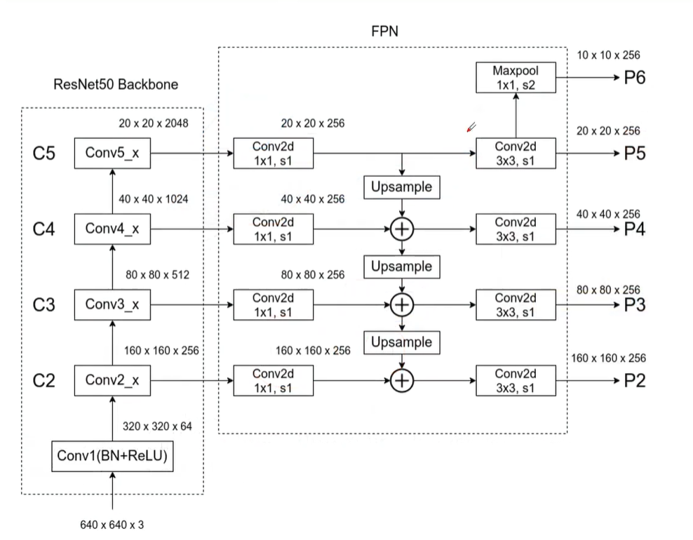

## FPN

> 原有的目标检测算法通常都是只采用顶层特征做检测，原因是网络顶层特征的语义信息比较丰富。然而，虽顶层特征的语义信息丰富，但其中的目标位置信息却比较粗略，不利于目标包围框的准确定位；相反，虽然底层特征的语义信息比较少，但其中目标的位置信息却非常准确。
>
> 现有情况：
>
> 低特征层：高分辨率，语义不强，利于小目标检测
>
> 高特征层：低分辨率，语义强
>
> 思想：利用低层次的高分辨率和高层次的强语义进行融合

现有金字塔结构：

1. 使用图像金字塔，构建`特征金字塔`进行逐层预测
2. 图像提取特征，在图像金 字塔的最后一层进行预测
3. 图像提取特征，根据特征分层进行预测
4. FPN方式：将2和3的方式融合，分层抽取特征，自顶向下进行特征融合，并且每层进行预测

过程：

> 自底向上：将相同尺寸输出的特征层归为一个stage，该stage拥有该层最强的特征
>
> 自顶向下：**高层次特征图与低层次特征图融合**
>
> 1.将上层特征图进行二倍上采样（邻居插值算法）
>
> 2.针对每一个特征图，都会使用1x1的卷积层进行处理（目的：调整backbone上不同特征图的channel）
>
> 3.将经过1x1卷积层处理的特征图和经过二倍上采样处理的特征图特征图进行相加	



基于ResNet的具体实现：

```python
import torch
from torch import nn


# 残差
class Residual(nn.Module):
    def __init__(self, in_channel, out_channel, use_1x1=False, stride=1):
        super().__init__()
        # kernel size = 3 padding = 1 高宽不变
        self.conv1 = nn.Conv2d(in_channel, out_channel, kernel_size=3, padding=1, stride=stride)
        self.bn1 = nn.BatchNorm2d(out_channel)
        self.ReLu = nn.ReLU(inplace=True)

        self.conv2 = nn.Conv2d(out_channel, out_channel, kernel_size=3, padding=1)
        self.bn2 = nn.BatchNorm2d(out_channel)

        # 降低通道 kernel size 1x1
        if use_1x1:
            self.conv3 = nn.Conv2d(in_channel, out_channel, kernel_size=1, stride=stride)
        else:
            self.conv3 = None

    def forward(self, x):
        out = self.ReLu(self.bn1(self.conv1(x)))
        out = self.bn2(self.conv2(out))

        if self.conv3 is not None:
            x = self.conv3(x)

        return self.ReLu(x + out)


# stage
def resnetBlock(in_channel, out_channel, size, is_First=False):
    blk = []
    for i in range(size):
        # not (is_First = True) ==> False
        if i == 0 and not is_First:
            # 其他通道 高宽减半
            blk.append(Residual(in_channel, out_channel, use_1x1=True, stride=2))
        else:
            # 第一个通道时 输入输出大小一致
            blk.append(Residual(out_channel, out_channel))
    return blk


class resNet_Fpn(nn.Module):
    def __init__(self):
        super().__init__()
        self.b1 = nn.Sequential(
            nn.Conv2d(1, 64, kernel_size=7, stride=2, padding=3),
            nn.BatchNorm2d(64), nn.ReLU(), nn.MaxPool2d(kernel_size=3, stride=2, padding=1)
        )
        # 四个残差块
        # 第一个残差块
        self.b2 = nn.Sequential(*resnetBlock(64, 64, 2, is_First=True))
        # 其他通道
        self.b3 = nn.Sequential(*resnetBlock(64, 128, 2))
        self.b4 = nn.Sequential(*resnetBlock(128, 256, 2))
        self.b5 = nn.Sequential(*resnetBlock(256, 512, 2))
        # top layer 2048,256???
        self.latlayer1 = nn.Conv2d(2048, 256, kernel_size=1)
        # lateral
        self.latlayer2 = nn.Conv2d(1024, 256, kernel_size=1)
        self.latlayer3 = nn.Conv2d(512, 256, kernel_size=1)
        self.latlayer4 = nn.Conv2d(256, 256, kernel_size=1)

        # smooth,防止混叠？
        self.smooth1 = nn.Conv2d(256, 256, kernel_size=3, stride=1, padding=1)
        self.smooth2 = nn.Conv2d(256, 256, kernel_size=3, stride=1, padding=1)

    def upSample_add(self, x, y):
        # x 进行两倍上采样
        trans = nn.Upsample(scale_factor=2, mode='bilinear')
        # # 得到四维矩阵的h，w
        # h, w = y.shape()[2], y.shape()[3]
        # 融合
        return trans(x) + y

    def forward(self, x):
        # bottom - top
        c1 = self.b1(x)
        c2 = self.b2(c1)
        c3 = self.b3(c2)
        c4 = self.b4(c3)
        c5 = self.b5(c4)

        # top - bottom
        p5 = self.latlayer1(c5)
        p6 = self.smooth2(nn.MaxPool2d(kernel_size=1))
        # 上采样，融合
        p4 = self.smooth1(self.upSample_add(p5, self.latlayer2(c4)))
        p3 = self.smooth1(self.upSample_add(p4, self.latlayer3(c3)))
        p2 = self.smooth1(self.upSample_add(p3, self.latlayer4(c2)))

        return p6, p5, p4, p3, p2,


fpn = resNet_Fpn()
print(fpn)
```


## RCNN、RPN

### Regions with CNN features（RCNN）

> R-CNN使用了一种非常简单的检测策略，首先在图像中提取Object Proposals，接下来把每个Proposal缩放到相同的大小后使用在ImageNet上训练好的Alexnet网络[19]提取特征，最后再使用SVM分类器进行虚警排除和类别判断。

### FRCNN

>Faster-RCNN最大的创新点在于设计了候选区域生成网络（RegionProposal Network，RPN），并在其中设计了“多参考窗口”的机制，将Selective Search或Edge Boxes等外部Objectproposal检测算法融合到同一个深度网络中实现。

## 其他

YOLO

>从算法的名字就能够看出来作者彻底放弃了Proposal这一概念，直接将整张图像作为网络的输入，并仅通过一次前向传播直接得到目标包围框的位置和目标的类别。YOLO虽然有着非常快的检测速度，但其精度与Faster-RCNN相比有所下降，尤其是小目标检测效果较差，其定位的准确度也稍有不足。这主要是由于YOLO没有采用类似FasterRCNN中的“多参考窗口”的机制处理多尺度窗口问题。后来提出的SSD算法改善了这些问题。


SSD

>首先，SSD是在多个尺度下的特征图上设置多个参考窗口进行后选框的检测，而Faster-RCNN仅仅是在一个尺度上进行处理；其次，Faster-RCNN是先利用提取目标后选框，然后再在后选框基础上利用检测网络和ROIPooling进行后续判断，SSD则直接分别在多个尺度的特征图上进行多尺度检测和包围框坐标回归。此外，SSD在训练过程中，还采用了难样本挖掘操作来对图像中难样本进行聚焦。


