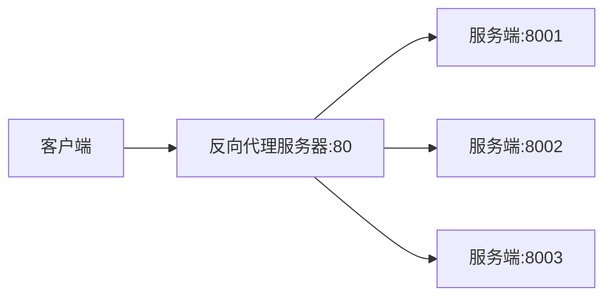
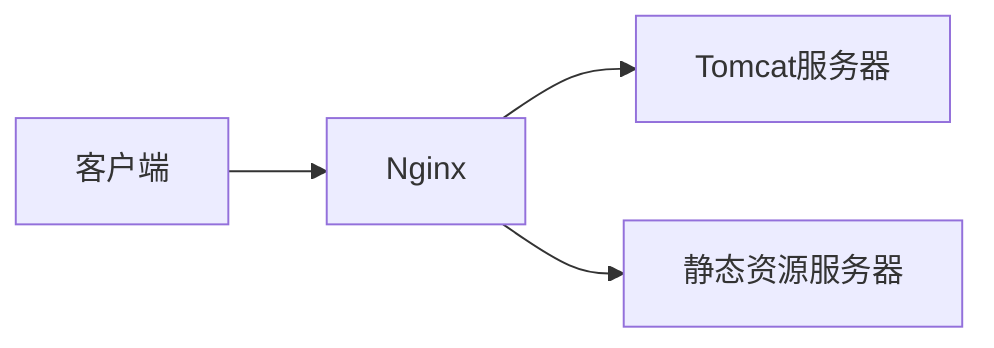
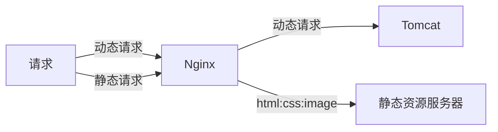
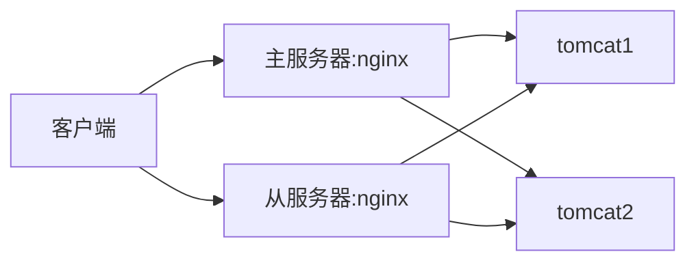

# Nginx

> *Nginx* (engine x) 是一个高性能的HTTP和反向代理)web服务器，同时也提供了IMAP/POP3/SMTP服务。
> 其特点是占有内存少，并发能力强，事实上nginx的并发能力在同类型的网页服务器中表现较好。

## 概念

### 反向代理

1. **正向代理**

   > 在客户端(浏览器)配置代理服务器，通过代理服务器进行互联网访问。

   ```mermaid
   graph LR
   	客户端 -->|x| www.google.com
   	客户端 -->|客户端设置代理访问| www.abc.com -->www.google.com
   ```

2. **反向代理**

   > 反向代理服务器位于用户与目标服务器之间，但是对于用户而言，反向代理服务器就相当于目标服务器，即用户直接访问反向代理服务器就可以获得目标服务器的资源。

   ```mermaid
   graph LR
   	客户端 --> 反向代理服务器:80 -->|Nginx指定映射地址| tomcat:8080
   ```

### 负载均衡

> 指将负载（工作任务）进行平衡、分摊到多个操作单元上进行运行



### 动静分离

> 为了加快网站的解析速度，可以把动态页面和静态页面由不同的服务器来解析，加快解析速度。降低原来单个服务器的压力。



### 高可用

> 高可用HA（High Availability）是分布式系统架构设计中必须考虑的因素之一，它通常是指，通过设计`减少系统`不能提供服务的时间。

## Nginx 常用命令

进入nginx目录：`/usr/local/nginx/sbin`

1. 查看nginx版本号

   ```shell
   ./nginx -v
   ```

2. 启动nginx

    ```shell
   ./nginx
   ```

3. 关闭nginx

     ```shell
   ./nginx -s stop
   ```

4. 重新加载nginx、配置文件生效

   ```shell
   ./nginx -s reload
   ```

## Nginx配置文件

位置：`/usr/local/nginx/conf/nginx.conf`

### 三部分

#### 全局块

> 从配置文件开始到events块之间的内容，主要设置一些影响nginx服务器整体运行的配置指令。

`worker_processes 1;`：worker_processes 值越大，可以支持的并发处理量也就越多，但是会受到硬件软件等设备的制约。 

#### events块

> events块涉及的指令主要影响Nginx服务器与用户的网络连接。
>
> 常用设置:
>
> 1. 是否开启对多work process下的网络连接进行序列化
> 2. 是否运行同时接收多个网络连接
> 3. 选取那种事件驱动模型来处理连接请求
> 4. 每个work process 可以同时支持的最大连接数等

  `worker_connections 1024;`：支持的最大连接数

#### http块

**`http块`包含`http全局块、server块`**

`http全局块`：配置的指令包括文件引入、MIME-TYPE定义、日志自定义、连接超时时间、单链接请求上限。

  `server块`：包括监听端口、设置域名、项目路径

- 一个server块可以有多个location块

## Nginx 反向代理

 **反向代理1**：本地网站的反向代理

1. 准备工作

   1. 安装tomcat并启动：进入bin目录输入 ./startup.sh启动tomcat
   2. 对外开放端口

   ```shell
   firewall-cmd --add-port=8080/tcp --permanent 	#添加8080端口
   firewall-cmd --reload	# 重启防火墙
   firewall-cmd --list-all # 查看所有端口
   ```

   3.  访问过程


2. 在nginx进行请求转发的配置(反向代理配置)

   server块中的server_name配置为域名

    ```
   server_name myBlog.12zw.club;
    ```

   location块中添加代理

   ```
       location /
       {
           proxy_pass "http://myBlog.12zw.club:8080";
           proxy_set_header Host myBlog.12zw.club;
           proxy_set_header X-Forwarded-For $remote_addr;
       }
   ```

 **反向代理2**：服务器集群的反向代理

> 如果请求中有/edu/**,则访问8080端口
>
> 如果请求中有/vod/**，则访问8081端口

```
server{
	listen 9001;
	server_name myBlog.12zw.club;
	
	// ~ ： 正则
	location ~ /edu/ {
		proxy_pass "http://localhost:8080";
	}
	
	location ~ /vod/ {
		proxy_pass "http://localhost:8081";
	}
	
}
```


## Nginx 负载均衡

修改nginx.conf中的http模块

添加`upstream`,并重新设置`server`

 ```
http{
        include       mime.types;
		#include luawaf.conf;

		...
		
		// 设置负载均衡
		upstream myserver{
			//服务器列表（默认轮询）
			server myblog.12zw.club:8080;
			server myblog.12zw.club:8081;
			
			//权重
			//server myblog.12zw.club:8080 weight=1;
			//server myblog.12zw.club:8081 weight=2;
			
			//ip_hash：指定访问某一台服务器
			//ip_hash;
			
			//fair：根据后端响应时间分配、响应时间短优先访问
			//fair;
		}
		
		server {
			listen 80;
			server_name myblog.12zw.club;
			
			location / {
				proxy_pass http://myserver;
			}
		}
		
        ...
 ```

**负载均衡策略**

- 轮询（默认）
- 权重：权重越大，越容易分配客户端请求
- ip_hash：每个请求按访问ip的hash结果分配、这样每个访客固定访问一个后端服务器、可以解决session的问题。
- fair：根据后端响应时间分配、响应时间短优先访问

## Nginx 动静分离

> 简单来说就是将动态跟静态请求分开，不能理解成只是把动态页面和静态页面物理分离。严格意义上来说应该是`动态请求和静态请求分开`，可以理解为使用`Nginx处理静态页面，Tomcat处理动态页面`。
>
> 动静分离大致分为两种：
>
> 1. 纯粹把静态文件独立成单独的域名，放在独立的服务器上，也是目前主流的推崇方案。
>
>  	2. 另一个方法就是动态和静态文件混合在一起发布，通过Nginx来分开。

通过location指定不同的后缀名实现不同的请求转发。通过设置expire参数设置，设置浏览器缓存过期时间，减少与服务器之间的请求和流量。



nginx配置

```
server{
	location /www/ {
		root /data/;
		index index.html,index.php;
		expires      30d; //过期时间
	}
	
	location /image/ {
		root /data/;
		autoindex on; //列出当前文件夹中的内容
	}
	
}
```

常见nginx配置

```
        //静态资源过期时间设置
        location ~ .*\.(gif|jpg|jpeg|png|bmp|swf)$
        {
            expires      30d;
        }
		
        location ~ .*\.(js|css)?$
        {
            expires      12h;
        }
		
        location ~ /\.
        {
            deny all;
        }
```

## 高可用

Nginx配置高可用的集群，防止nginx宕机而无法使用




安装`keepalived`,修改etc下的`keepalived.conf`文件

[高可用]: https://www.bilibili.com/video/av68136734?p=15

## Nginx原理

一个master分配任务、多个worker争抢任务（根据cpu的数量来设置worker的数量）

1. 发送一个请求，占用worker的几个链接数？

> 2或4，静态资源两个、动态请求4个，转发到tomcat

2. nginx有一个master、有四个worker、每个worker支持最大链接数1024，支持的最大并发数是多少？

> 静态资源的最大并发数 （4 * 1024） / 2
>
> http作为反向代理 （4 * 1024 ）/4


